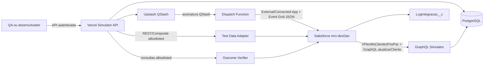

# Plano de Desenvolvimento: API Simuladora do MS Clientes para Unificacao 2.2

## 1. Resumo executivo

Este documento define o plano completo para construir uma API independente, hospedada no Vercel, que simule os contratos do MS Clientes necessarios para testar a Unificacao 2.2 na org `mrv-devDan`, sem depender da `mrv-staging`.

A solucao tera quatro responsabilidades principais:

1. Publicar no Salesforce os eventos do Azure Event Grid consumidos pelo endpoint Apex `/Cliente`.
2. Responder ao callback GraphQL `atualizarCliente` feito pelo Salesforce durante a vinculacao do IdProspect.
3. Preparar e remover dados sinteticos de teste de forma controlada e restrita a cada execucao.
4. Verificar por assertions consultivas se Account, Lead e Proponente__c ficaram no estado esperado.

O simulador devera reproduzir sequencias realistas, incluindo eventos fora de ordem, duplicados, atrasados, falhas HTTP e respostas GraphQL invalidas. A API nao classifica dados de negocio como reais ou fake. Autorizacao, minimizacao, retencao e LGPD continuam sob responsabilidade operacional, e arquivos brutos permanecem fora do Git.

A implementacao sera feita em um repositorio separado do Salesforce, em `D:\Documentos\Trabalho\Ambientes\MRV\MS Cliente`, com TypeScript, Vercel Functions, Neon PostgreSQL e Upstash QStash. O callback usara Named Credential e External Credential dedicados ao simulador; `ServicoClientes` permanece restrito ao provedor de identidade do MS Clientes real.

### 1.1 Decisoes confirmadas em 2026-08-22

- Nao ha dependencia de reuniao ou alinhamento previo para iniciar; a Fase 0 valida e configura tecnicamente as decisoes ja aprovadas.
- Vercel, Neon e Upstash QStash estao permitidos.
- O projeto independente sera criado em `D:\Documentos\Trabalho\Ambientes\MRV\MS Cliente`.
- O alvo Salesforce e `mrv-devDan`, Organization Id `00DHZ000006mzDp2AI`, sandbox na instancia `BRA6S`.
- O MVP funcional cobre Account, Lead e Proponente__c.
- Opportunity e PropostaAnaliseCredito__c fazem parte do scaffolding obrigatorio de fixture, sem validar ainda os fluxos funcionais `/PAC` e `/MaquinaEstado`.
- Setup, assertions e cleanup usam Salesforce REST/Composite, com operacoes allowlisted, credencial propria e Permission Set de minimo privilegio.
- O callback pos-PAC usara o Named Credential dedicado `VFlexMsClientesPosPac`, com o mesmo DeveloperName em todos os ambientes e configuracao por org.
- Em `mrv-devDan`, `VFlexMsClientesPosPac` aponta para o simulador; em staging e producao, aponta para o MS Clientes real.
- Somente `MSClienteService` sera proposto para migrar ao novo Named Credential. Essa alteracao Apex exige aprovacao explicita antes da implementacao.

## 2. Contexto e motivacao

A Unificacao 2.2 e executada depois da aprovacao da PAC. O Salesforce recebe eventos assincronos do MS Clientes e decide se deve atualizar uma Account existente, criar uma nova estrutura ou descartar um evento defensivamente.

Os principais pontos de integracao atuais sao:

- Entrada: `NotificacaoCliente`, exposta em `/services/apexrest/Cliente`.
- Saida atual: `MSClienteService.atualizarCliente`, que envia a mutation GraphQL `atualizarCliente` por `VFlexMsClientes`.
- Estado alvo do simulador: destino e autenticacao dedicados ao callback pos-PAC; `ServicoClientes` permanece restrito ao MS Clientes real.
- Logs: `IntegrationLog__e`, persistido como `LogIntegracao__c`.

A ordem de chegada nao e garantida. Eventos `contato-*` e `endereco-*` podem chegar antes de `cliente-*`. Portanto, um mock que apenas retorna HTTP 200 nao cobre os riscos reais da Unificacao 2.2.

## 3. Objetivos

### 3.1 Objetivos funcionais

- Disponibilizar catalogo versionado de cenarios da Unificacao 2.2.
- Executar cenarios sob demanda contra a `mrv-devDan`.
- Publicar envelopes compativeis com Azure Event Grid.
- Controlar ordem, intervalo, duplicidade e reentrega dos eventos.
- Simular sucesso, erro, timeout e resposta invalida do GraphQL `atualizarCliente`.
- Registrar cada passo e sua resposta HTTP.
- Permitir consulta do andamento e do resultado de uma execucao.
- Permitir repeticao deterministica com os mesmos dados sinteticos.
- Correlacionar requests GraphQL recebidos com a execucao que os originou.
- Preparar pre-condicoes sinteticas com escopo minimo e ownership por `runId`.
- Provisionar Proponente__c com celular e e-mail efetivos para `NotificacaoCliente.insertLeadQueueable`.
- Provisionar Opportunity e PropostaAnaliseCredito__c apenas como dependencias tecnicas do Proponente__c.
- Executar assertions Salesforce depois da conclusao assincrona.
- Remover apenas os dados comprovadamente criados pela propria execucao.

### 3.2 Objetivos de qualidade

- Nao persistir payload bruto; armazenar somente metadados redigidos e minimizados.
- Impedir tecnicamente chamadas para staging ou producao.
- Preservar os contratos Apex existentes no MVP.
- Oferecer idempotencia para evitar disparos acidentais repetidos.
- Produzir trilha de auditoria sem tokens, Authorization ou dados de negocio em
  texto claro; registrar somente metadados necessarios.
- Manter todos os contratos descritos em OpenAPI e schemas TypeScript.
- Nunca reutilizar no simulador bearer token emitido para o MS Clientes real.
- Isolar os identificadores persistidos por execucao, mesmo quando a mesma seed for reutilizada.

### 3.3 Fora de escopo inicial

- Substituir o Azure Event Grid corporativo.
- Simular todo o dominio do MS Clientes.
- Corrigir ou remediar dados existentes em qualquer org.
- Alterar regras de unificacao em Apex.
- Executar contra `mrv-staging`, pre-producao ou producao.
- Importar logs brutos por endpoint publico.
- Fornecer ambiente de teste de carga do Salesforce.
- Disponibilizar endpoint Apex de DML generico ou aceitar SOQL/DML arbitrario enviado pelo usuario.
- Validar funcionalmente os endpoints `/PAC` e `/MaquinaEstado` no primeiro MVP.

## 4. Escopo por entregas

### 4.1 MVP: Account, Lead e Proponente__c

O MVP cobre o fluxo essencial da Unificacao 2.2:

- `cliente-insert` e `cliente-update`.
- `contato-insert` e `contato-update`.
- `endereco-insert` e `endereco-update`.
- Callback GraphQL `atualizarCliente`.
- Ordem normal e invertida.
- Eventos duplicados e obsoletos.
- Falhas configuraveis do callback.
- Consulta de execucao e auditoria.
- Provisionamento controlado de pre-condicoes sinteticas.
- Verificacao automatizada de Account, Lead e Proponente__c.
- Validacao de que `NotificacaoCliente.insertLeadQueueable` usa celular/e-mail efetivos do Proponente__c.
- Validacao de que `Proponente__c.IdProponente__c` fica sincronizado com o Lead final.
- Provisionamento de Opportunity e PropostaAnaliseCredito__c como scaffolding tecnico exigido pelo master-detail de Proponente__c.
- Cleanup restrito aos registros criados pela execucao.

O scaffolding de Opportunity e PropostaAnaliseCredito__c existe apenas para setup e cleanup do MVP. Ele nao inclui assertions funcionais de `/PAC`, `/MaquinaEstado` ou associacao final da Opportunity.

### 4.2 Extensao: PAC, Maquina de Estado e Opportunity

A segunda entrega cobre o fluxo completo pos-PAC:

- Eventos consumidos por `/PAC`.
- Eventos `jornadausuario-*` consumidos por `/MaquinaEstado`.
- Validacoes adicionais de Proponente__c nos eventos PAC.
- Associacao defensiva da Opportunity a Account aprovada.
- Corridas entre `cliente-*`, PAC e maquina de estado.

### 4.3 Interface administrativa opcional

Uma interface web pode ser adicionada depois da estabilizacao da API para selecionar cenarios, informar variaveis sinteticas e acompanhar execucoes. Ela nao faz parte do MVP e nao deve atrasar os contratos ou os testes automatizados.

### 4.4 Sequenciamento do MVP

Para desbloquear testes rapidamente sem perder os controles essenciais, a primeira entrega executavel deve conter:

- endpoint GraphQL dedicado e autenticado;
- publicacao de um evento por request no `/Cliente`;
- Safety Guard;
- catalogo estatico dos cenarios prioritarios;
- persistencia minima de runs, passos e callbacks;
- setup, assertions e cleanup allowlisted;
- execucao por API, sem interface web.

Cancelamento administrativo avancado, dashboards, alertas completos, catalogo editavel e a extensao PAC/Opportunity ficam para entregas posteriores. QStash e obrigatorio quando o cenario precisar de agendamento duravel; sequencias imediatas podem usar o mesmo orquestrador sem atrasos artificiais.

## 5. Decisoes de arquitetura

As decisoes de plataforma e isolamento abaixo estao confirmadas. Somente mudancas em Apex ou metadados Salesforce continuam sujeitas a aprovacao explicita antes da implementacao.

| Decisao | Definicao | Justificativa |
|---|---|---|
| Hospedagem | Vercel Functions | Plataforma permitida e com baixa operacao de infraestrutura. |
| Runtime | Node.js LTS com TypeScript | Tipagem, ecossistema de validacao e suporte nativo no Vercel. |
| Framework | Next.js Route Handlers | Integra facilmente API, observabilidade e eventual interface administrativa. |
| Validacao | Zod | Validacao de entrada, configuracao e payloads externos na borda. |
| GraphQL | Pacote `graphql` ou GraphQL Yoga | Evita parser textual ad hoc e aceita `application/graphql`. |
| Persistencia | Neon PostgreSQL | Estado duravel, consultas de auditoria e boa integracao com Vercel. |
| ORM | Drizzle ORM | Tipagem, migrations pequenas e baixo overhead para serverless. |
| Agendamento | Upstash QStash | Entrega duravel de passos atrasados, reentregas e verificacao de assinatura. |
| Testes | Vitest e testes HTTP de contrato | Execucao rapida e adequada a TypeScript. |
| Especificacao | OpenAPI 3.1 | Contrato REST versionado e testavel. |
| Fixtures | Arquivos JSON/TypeScript versionados | Revisao em PR e execucao deterministica. |
| Repositorio | Projeto separado em `D:\Documentos\Trabalho\Ambientes\MRV\MS Cliente` | Isola deploy, segredos, dependencias e ciclo de vida do simulador. |
| Entrada Vercel -> Salesforce | External Client App ou Connected App dedicada, OAuth Client Credentials ou JWT e usuario de integracao exclusivo | Separa a identidade do simulador e limita o acesso ao `/Cliente` e ao REST/Composite allowlisted. |
| Callback Salesforce -> Vercel | `VFlexMsClientesPosPac` + External Credential dedicados, com autenticacao e audience exclusivas | Injeta autenticacao no Salesforce sem depender de `ServicoClientes`; External Client App Salesforce nao autentica esta direcao. |
| Configuracao do callback | Mesmo DeveloperName em todas as orgs; destino configurado por org | `mrv-devDan` usa simulador; staging e producao usam o MS Clientes real com o mesmo codigo Apex. |
| Ciclo de dados de teste | Salesforce REST/Composite com operacoes allowlisted | Permite E2E real sem expor DML ou SOQL arbitrario. |
| Isolamento | Seed define o caso; `runId` cria namespace persistido | Mantem repetibilidade sem transformar NO-MATCH em MATCH por residuos de execucoes anteriores. |
| Envelope no MVP | Exatamente um evento por request | Evita interferencia de estado entre eventos processados pela mesma instancia Apex. |

### 5.1 Alternativas consideradas

#### API sem banco

Rejeitada para o fluxo completo. Memoria de Vercel Functions nao e persistente e nao permite acompanhar passos assincronos de forma confiavel.

#### `setTimeout` dentro da Function

Rejeitado. A execucao pode ser encerrada pelo runtime, e atrasos longos nao sobrevivem a reinicios.

#### Armazenar todos os logs de staging na aplicacao

Rejeitado por LGPD, risco operacional e acoplamento desnecessario. Sera analisada temporariamente uma amostra estratificada de 5 a 10 exemplos por variacao estrutural relevante; arquivos brutos ficam fora do Git e somente fixtures contratualmente validas, sem segredos e operacionalmente revisadas podem ser versionadas.

#### Reutilizar o token obtido pelo Named Credential compartilhado `ServicoClientes`

Rejeitado. O token atual e emitido para o MS Clientes real e nao deve ser transmitido ao Vercel, ainda que o simulador consiga validar sua assinatura. O callback deve usar credencial, audience e segredo exclusivos do simulador.

#### Redirecionar globalmente o Named Credential `VFlexMsClientes`

Rejeitado. O Named Credential tambem e usado por classes alem de `MSClienteService`, incluindo fluxos pre-PAC e de Venda Generica. O isolamento confirmado cria `VFlexMsClientesPosPac` e altera somente `MSClienteService`, apos aprovacao explicita da proposta Apex.

#### Implementar parser GraphQL com expressoes regulares

Rejeitado. O corpo pode variar em espacos, ordem e campos; deve ser processado por uma biblioteca GraphQL.

## 6. Arquitetura logica



### 6.1 Componentes

- **Scenario Catalog:** carrega e valida cenarios versionados.
- **Run Orchestrator:** cria execucoes e calcula a agenda de passos.
- **QStash Publisher:** agenda cada passo de forma duravel.
- **Salesforce Client:** autentica por External Client App ou Connected App dedicada e publica no Apex REST/Composite.
- **GraphQL Simulator:** valida a mutation e retorna comportamento configurado.
- **Run Repository:** persiste execucoes, passos, tentativas e callbacks.
- **Secret Sanitizer:** remove credenciais e mascara segredos tecnicos antes de
  persistir metadados de log.
- **Safety Guard:** confirma host, Organization Id e ambiente permitido antes de qualquer envio.
- **Audit Service:** registra quem iniciou, repetiu ou cancelou uma execucao.
- **Test Data Adapter:** prepara e remove por REST/Composite somente pre-condicoes sinteticas permitidas, identificadas pelo `runId`, inclusive Opportunity e PropostaAnaliseCredito__c como scaffolding do Proponente__c.
- **Outcome Verifier:** executa consultas predefinidas e avalia assertions do cenario sem aceitar SOQL arbitrario.

## 7. Fluxos principais

### 7.1 Criacao de uma execucao

1. Cliente chama `POST /api/v1/runs` com um `scenarioKey` e variaveis sinteticas.
2. API autentica e autoriza o solicitante.
3. Zod valida a requisicao.
4. Catalogo carrega a versao do cenario.
5. Safety Guard valida que o alvo e exclusivamente `mrv-devDan`.
6. API gera `runId`, IDs externos sinteticos e timestamps deterministas.
7. A seed determina os valores logicos; o `runId` compoe o namespace dos IDs persistidos.
8. API persiste a execucao e seus passos.
9. API cria o setup allowlisted como primeiros passos da execucao.
10. API agenda setup e dispatches dependentes de forma duravel.
11. API retorna `202 Accepted` com o `runId`; provisionamento e envio continuam assincronamente.

### 7.2 Publicacao de um evento

1. QStash chama o endpoint interno de dispatch.
2. API valida a assinatura QStash e rejeita chamadas diretas.
3. API bloqueia o passo se a execucao estiver cancelada.
4. Salesforce Client obtem ou reutiliza token de curta duracao.
5. Safety Guard valida novamente host, Organization Id e sandbox.
6. Cliente envia o envelope ao `/services/apexrest/Cliente`.
7. Request sanitizado, status HTTP, duracao e response sanitizado sao persistidos.
8. Politica do cenario decide sucesso, retry ou falha final.

Depois do ultimo dispatch, a execucao entra em `WAITING_ASYNC` quando houver Queueable ou callback esperado. Receber HTTP 200 do Apex REST nao significa que o cenario terminou.

### 7.3 Callback GraphQL

1. `MSClienteService` chama `callout:VFlexMsClientesPosPac` com destino configurado por org.
2. O Named Credential e a External Credential injetam a autenticacao dedicada; a API valida HTTPS, audience, identidade e limite de tamanho.
3. Parser GraphQL valida que a operacao e `atualizarCliente`.
4. API extrai apenas IDs tecnicos necessarios para correlacao.
5. Politica associada a execucao escolhe sucesso, erro, atraso ou payload invalido.
6. API persiste request e response sanitizados.
7. API devolve resposta compativel com o contrato atual.
8. Quando todos os callbacks esperados forem recebidos, ou quando a janela assincrona terminar, a execucao entra em `VERIFYING`.
9. Outcome Verifier consulta os registros permitidos e avalia as assertions.
10. Cleanup remove somente os registros pertencentes ao `runId`, quando habilitado e seguro.

## 8. Contratos REST propostos

Todos os endpoints de gestao usam `/api/v1`. Erros seguem um formato unico:

```json
{
  "error": {
    "code": "VALIDATION_ERROR",
    "message": "Invalid request",
    "requestId": "req_01J...",
    "details": {}
  }
}
```

`details` nao pode conter payload bruto, token, Authorization ou campos de negocio
diretos; somente metadados minimizados.

### 8.1 Saude

#### `GET /api/v1/health`

Verifica aplicacao, banco e configuracao. Nao realiza DML nem dispara eventos.

Resposta `200`:

```json
{
  "status": "ok",
  "version": "1.0.0",
  "dependencies": {
    "database": "ok",
    "qstash": "ok"
  }
}
```

### 8.2 Catalogo de cenarios

#### `GET /api/v1/scenarios`

Lista cenarios ativos com paginacao e filtros por tag.

Parametros:

- `page`
- `pageSize`
- `tag`
- `scope`: `CORE` ou `EXTENDED`

#### `GET /api/v1/scenarios/{scenarioKey}`

Retorna metadados, versao, variaveis aceitas e passos, sem revelar segredos.

### 8.3 Execucoes

#### `POST /api/v1/runs`

Cria uma execucao.

Headers:

- `Authorization: Bearer <token>`
- `Idempotency-Key: <uuid>` obrigatorio

Request:

```json
{
  "scenarioKey": "cpf-divergente-nova-estrutura",
  "scenarioVersion": 1,
  "variables": {
    "seed": "TC001-A",
    "eventStartAt": "2026-08-21T10:00:00Z"
  },
  "execution": {
    "dryRun": false,
    "speed": 1,
    "stopOnFailure": true
  }
}
```

Resposta `202`:

```json
{
  "data": {
    "runId": "run_01J...",
    "status": "SCHEDULED",
    "scenarioKey": "cpf-divergente-nova-estrutura",
    "scenarioVersion": 1,
    "createdAt": "2026-08-21T10:00:00Z"
  }
}
```

`dryRun=true` valida e renderiza setup, eventos, assertions e cleanup, mas nao chama Salesforce.

O estado consolidado pode assumir `CREATED`, `PROVISIONING`, `SCHEDULED`, `RUNNING`, `WAITING_ASYNC`, `VERIFYING`, `SUCCEEDED`, `FAILED`, `PARTIAL`, `CANCELLING` ou `CANCELLED`.

#### `GET /api/v1/runs`

Lista execucoes com paginacao e filtros por status, cenario e intervalo de data.

#### `GET /api/v1/runs/{runId}`

Retorna estado consolidado e links para os passos.

#### `GET /api/v1/runs/{runId}/steps`

Lista passos, tentativas e respostas sanitizadas.

#### `POST /api/v1/runs/{runId}/cancellations`

Solicita cancelamento dos passos ainda nao enviados. Passos em processamento podem concluir.

#### `POST /api/v1/runs/{runId}/retries`

Cria uma nova tentativa apenas para passos elegiveis, mantendo a trilha original.

### 8.4 Endpoint interno de dispatch

#### `POST /api/v1/internal/dispatches`

Uso exclusivo do QStash. Requer assinatura valida, timestamp dentro da tolerancia e identificador de mensagem nao processado.

Nao deve ser exposto na documentacao publica de consumidores.

### 8.5 Endpoint GraphQL simulado

#### `POST /api/ms-clientes/graphql`

Aceita `Content-Type: application/graphql` e, opcionalmente, `application/json` conforme o cliente.

Mutation esperada:

```graphql
mutation {
  atualizarCliente(
    cliente: {
      id: "ID-CLIENTE-SINTETICO"
      idProspectSalesforce: "ID-PROSPECT-SINTETICO"
    }
  ) {
    id
  }
}
```

Resposta de sucesso:

```json
{
  "data": {
    "atualizarCliente": {
      "id": "ID-CLIENTE-SINTETICO"
    }
  }
}
```

Politicas de resposta suportadas:

- `SUCCESS_200`
- `SUCCESS_201`
- `GRAPHQL_ERROR_200`
- `HTTP_400`
- `HTTP_401`
- `HTTP_429`
- `HTTP_500`
- `INVALID_JSON_200`
- `EMPTY_BODY_200`
- `DELAYED_RESPONSE`

O atraso deve respeitar o limite de execucao do Vercel. Para simular timeout do Salesforce, a Function pode aguardar acima de 12 segundos somente se o plano Vercel suportar a duracao configurada. Caso contrario, deve-se usar um endpoint dedicado que encerre ou mantenha a conexao conforme a capacidade aprovada. Retornar imediatamente outro erro HTTP nao e evidencia equivalente de timeout.

## 9. Envelope Event Grid

Formato base:

```json
[
  {
    "id": "sim-run_01J-step_001",
    "subject": "MS_Clientes",
    "data": {
      "idcliente": "CLI-SIM-TC001-A",
      "idprospectsalesforce": "PRO-SIM-TC001-A",
      "dataalteracao": "2026-08-21T10:00:00Z"
    },
    "eventType": "cliente-insert",
    "eventTime": "2026-08-21T10:00:00Z",
    "dataVersion": "1.0",
    "metadataVersion": "1",
    "topic": "/simulator/ms-clientes"
  }
]
```

No MVP, o array deve conter exatamente um item (`minItems: 1`, `maxItems: 1`). Cada passo do cenario gera uma requisicao HTTP independente. O suporte a lotes fica reservado a um cenario especifico posterior.

### 9.1 Regras do gerador

- Usar nomes de campos compativeis com o contrato real; o Apex normaliza para minusculas.
- Gerar valores logicos deterministicamente a partir da seed e adicionar namespace derivado do `runId` aos identificadores persistidos.
- Gerar `eventTime` e `dataalteracao` separadamente para permitir eventos obsoletos.
- Permitir CPF, e-mail, telefone, nome, endereco, CEP e IDs de negocio exigidos
  pelo contrato sem classificar procedencia real/fake.
- Gerar CPF sintetico deterministico com checksum valido para compatibilidade
  Salesforce.
- Nao depender do nome, telefone ou e-mail para correlacao tecnica.
- Preservar a possibilidade de enviar eventos sem CPF, como ocorre em `contato-*` e `endereco-*`.
- Permitir reenvio do mesmo envelope com o mesmo `id` para testar idempotencia externa.

## 10. Modelo de cenarios

Exemplo de definicao:

```typescript
interface ScenarioDefinition {
  key: string;
  version: number;
  name: string;
  scope: 'CORE' | 'EXTENDED';
  tags: string[];
  variablesSchema: unknown;
  setup?: AllowlistedSetupInstruction[];
  steps: ScenarioStep[];
  expectedOutcomes: ExpectedOutcome[];
  asyncPolicy: {
    expectedCallbacks: { min: number; max: number };
    waitTimeoutMs: number;
    missingCallbackResult: 'SUCCESS' | 'PARTIAL' | 'FAILED';
  };
  cleanup?: AllowlistedCleanupInstruction[];
}

interface ScenarioStep {
  key: string;
  target: 'CLIENTE' | 'PAC' | 'MAQUINA_ESTADO';
  eventType: string;
  delayMs: number;
  payloadTemplate: unknown;
  deliveryPolicy: {
    duplicateCount: number;
    retryOn: number[];
    maxAttempts: number;
  };
}
```

`setup`, `expectedOutcomes` e `cleanup` devem usar operacoes tipadas e allowlisted. Nenhum deles pode receber SOQL, SOSL, nomes livres de objetos/campos ou DML arbitrario pela API.

No MVP, o mecanismo definido e Salesforce REST/Composite com credencial propria, Permission Set minimo e operacoes allowlisted. Salesforce CLI, endpoint Apex de test data, SOQL livre e DML arbitrario nao fazem parte deste fluxo.

Cada registro criado no setup deve carregar ou ser correlacionavel por um identificador tecnico derivado do `runId`. O cleanup deve falhar fechado quando nao conseguir comprovar ownership.

Para criar Proponente__c, o setup cria primeiro Opportunity e PropostaAnaliseCredito__c, pois os relacionamentos master-detail tornam essa cadeia obrigatoria. O Proponente__c fornece celular/e-mail efetivos e seu `IdProponente__c` deve ser comparado ao Guid do Lead final. Opportunity e PropostaAnaliseCredito__c nao recebem assertions funcionais no MVP, exceto existencia, ownership e remocao segura do scaffolding.

## 11. Catalogo minimo de cenarios

### 11.1 Basicos

| Chave | Cenario | Resultado principal esperado |
|---|---|---|
| `match-id-cliente` | Account encontrada por `Id__c` | Atualiza somente a Account correta. |
| `match-cpf-sem-id-cliente` | Account encontrada por CPF | Carimba Id Cliente sem criar duplicidade. |
| `no-match-cliente-insert` | Nenhuma Account encontrada | Cria nova Person Account. |
| `cliente-update-nova-estrutura` | Evento update sem estrutura previa | Cria ou completa a estrutura esperada. |

### 11.2 CPF divergente e protecoes

| Chave | Cenario | Resultado principal esperado |
|---|---|---|
| `cpf-divergente-nova-estrutura` | Jornada X, PAC Y, Account Y inexistente | Preserva X e cria Account/Lead Y. |
| `cpf-divergente-contato-primeiro` | `contato-*` de Y chega antes de `cliente-*` | Os `contato-*` sao descartados sem DML; o `cliente-insert` final preserva X e cria Account/Lead Y sem contatos. |
| `cpf-divergente-endereco-primeiro` | `endereco-*` chega antes de `cliente-*` | Evento parcial e descartado; X permanece intacto. |
| `cliente-update-divergente-conta-y-existente` | Account Y ja existe | Atualiza Y sem mover prospect de X. |
| `cliente-update-divergente-conta-y-inexistente` | Y ainda nao existe | Cria estrutura Y e preserva X. |

### 11.3 Arvore de decisao de Lead

| Chave | Cenario | Resultado principal esperado |
|---|---|---|
| `lead-mesmo-cpf-livre` | Lead Y do mesmo CPF sem Account | Reutiliza Lead Y. |
| `lead-mesmo-cpf-propria-conta` | Account Y ja aponta para Lead Y | Mantem e reutiliza Lead Y. |
| `lead-mesmo-cpf-outra-conta-caso-c` | Lead do CPF preso a outra Account | Nao reusa nem cria; Account fica sem IdProspect. |
| `fallback-lead-sem-cpf-por-email` | Lead livre sem CPF casa por e-mail | Reutiliza Lead e preenche CPF sintetico. |
| `fallback-lead-sem-cpf-por-celular` | Lead livre sem CPF casa por celular | Reutiliza Lead e preenche CPF sintetico. |
| `fallback-lead-sem-guid` | Lead reutilizado nao possui `Id__c` | Gera Guid antes de vincular. |

### 11.4 Regra 6.6

Os cenarios desta secao incluem Proponente__c no MVP, porque `NotificacaoCliente.insertLeadQueueable` usa seus valores efetivos de celular/e-mail e sincroniza `IdProponente__c` com o Lead final.

| Chave | Cenario | Resultado principal esperado |
|---|---|---|
| `novo-lead-colisao-celular` | Celular pertence a outro CPF | Cria Lead sem celular. |
| `novo-lead-colisao-email` | E-mail pertence a outro CPF | Cria Lead sem e-mail. |
| `novo-lead-colisao-ambos` | E-mail e celular pertencem a terceiros | Cria Lead somente com CPF e `InsertClientePAC`. |
| `novo-lead-sem-colisao` | Contatos nao colidem | Copia contatos efetivos do Proponente/Account. |
| `contatos-distribuidos-terceiros` | E-mail e celular pertencem a Leads diferentes | Nao contamina o Lead novo. |

### 11.5 Concorrencia e resiliencia

| Chave | Cenario | Resultado principal esperado |
|---|---|---|
| `evento-duplicado` | Mesmo evento enviado duas vezes | Segunda entrega nao corrompe dados. |
| `evento-obsoleto` | `dataalteracao` anterior ao persistido | Evento nao atualiza registro. |
| `ordem-invertida-completa` | Contato, endereco e cliente em ordem invertida | Resultado final preserva isolamento. |
| `graphql-erro-500` | Callback retorna 500 | Execucao real confirmou vinculo local preservado, callback observavel e run final `SUCCEEDED` (nao `PARTIAL`). |
| `graphql-resposta-invalida` | Callback retorna JSON inesperado | Execucao real confirmou vinculo local preservado; o body invalido fica persistido/correlacionavel e o run final observado foi `SUCCEEDED`. |
| `graphql-timeout` | Callback atrasado (~8s simulados, `maxDuration=15`) | Aproxima o timeout do Apex sem estourar o runtime; vinculo local permanece e o run observado termina `SUCCEEDED`. |
| `id-prospect-igual-id-cliente` | MS devolve echo incorreto | Salesforce cria a Account, mas nao carimba `IdProspectSalesforce__c`; nenhum Lead novo foi observado nesse recorte. |

### 11.6 Extensao PAC e Opportunity

| Chave | Cenario | Resultado principal esperado |
|---|---|---|
| `proponente-sincroniza-lead-final` | Lead final muda | Proponente principal recebe o mesmo Guid. |
| `pac-atrasada-nao-restaura-prospect` | Evento PAC antigo chega depois | Prospect obsoleto nao e restaurado. |
| `maquina-estado-sem-id-cliente` | Evento chega so com prospect da jornada | Opportunity permanece na Account aprovada. |
| `maquina-estado-obsoleto-sem-cliente` | Evento antigo nao resolve cliente | Responde sucesso sem fila manual. |
| `maquina-estado-atual-corrida` | Evento atual chega antes do cliente | Falha para permitir reentrega legitima. |

### 11.7 Rastreamento com o catalogo de ordens de eventos (referencia)

O arquivo `catalogo-ordens-eventos-ms-cliente-pos-pac.md` (skill
`salesforce-unificacao-clientes`) descreve 15 perfis formais de ordem de
eventos (`O01`-`O15`) observados ou inferidos do comportamento real do MS
Cliente/Apex. Esta tabela mantém o rastreamento vivo entre esses perfis e as
chaves de cenario deste plano. **Principio de execucao:** nenhum perfil deve
ser descartado do plano por analise estatica do codigo Apex antecipando o
resultado. O simulador existe para publicar a ordem de eventos real e deixar
o Apex real (`mrv-devDan`) reagir; o resultado observado (mesmo que seja "o
evento e descartado sem nenhuma escrita") deve ser executado, capturado e
documentado como evidencia, nao assumido a priori.

| Perfil | Nome | Chave de cenario (planejada) | Status |
|---|---|---|---|
| O01 | Parciais antes (`contato-insert` com `IDCLI-Y` ainda inexistente, `PROS-X`) | `cpf-divergente-contato-primeiro` | Implementado e validado ao vivo contra `mrv-devDan`: os dois `contato-insert` retornam HTTP 200, mas sao descartados sem DML; o `cliente-insert` final cria Account/Lead Y sem contatos e preserva X intacta. |
| O02 | Cliente antes (contato chega durante/apos o Queueable) | `contato-antes-cliente-colisao` (Fase 6, incremento 3) | Implementado e validado ao vivo contra `mrv-devDan` (9/9 checks, `run SUCCEEDED`). |
| O03 | Mesmo `eventTime` | `ordem-mesmo-eventtime-cliente-primeiro`, `ordem-mesmo-eventtime-contato-primeiro`, `ordem-mesmo-eventtime-endereco-primeiro` | Implementado e validado ao vivo contra `mrv-devDan`: as 3 permutacoes fisicas retornaram HTTP 200 em todos os dispatches e convergiram para o mesmo padrao final na Account (nome/CPF do `cliente-insert`, e-mail do `contato-email`, celular do `contato-celular`, logradouro do `endereco-insert`), sem depender da ordem de entrega. |
| O04 | PAC mutavel | `pac-atrasada-nao-restaura-prospect` (parcial) | Fase 7 (depende de `/PAC`). |
| O05 | PAC aprovada reentregue | — (a definir na Fase 7) | Fase 7. |
| O06 | Intervencao manual pos-PAC | — (a definir na Fase 7) | Fase 7. |
| O07 | Corrida Queueable vs PAC | `maquina-estado-atual-corrida` (parcial) | Fase 7. |
| O08 | Parciais com identidade antiga (`contato-insert(IDCLI-X, PROS-X)` antes de `cliente-insert(IDCLI-Y, PROS-X)`) | `cpf-divergente-identidade-antiga` | Implementado e validado ao vivo contra `mrv-devDan`: os dois `contato-insert` atualizam a Account X com C/D; o `cliente-insert` final cria Y e um Lead novo de Y, ambos sem contatos. **Diverge do texto do catalogo** ("X invariante, Y recebe C/D") — ver hipotese de reconciliacao via PAC abaixo e retestar na Fase 7. |
| O09 | Ordem composta Clarice (caso real complementar) | — | Fora do MVP atual; requer PAC + intervencao manual combinados. |
| O10 | Rajada concorrente Cliente/PAC | Script dedicado (`scripts/stress-o10-concurrent-events.ts`, `npm run stress:o10`) | Implementado como stress técnico fora do catálogo declarativo e validado ao vivo contra `mrv-devDan` em **dois modos**: **uniforme** (`cliente-update` puro) e **misto** (`cliente-update` + `contato-insert` Email/Celular + `endereco-insert`). Em ambos, 12/12 requisições retornaram HTTP 200, sem `UNABLE_TO_LOCK_ROW`/`DmlException` surfaced; no modo uniforme houve vencedor global variável (`Cliente Concorrente 10/11/12`) e no modo misto houve vencedores variáveis por campo (`LastName`, `PersonEmail`, `Celular__c`, `BillingStreet`), confirmando corrida real na mesma linha de Account. Evidência: `docs/phase-6/o10-stress-concorrencia.md`. |
| O11 | Jornada sem `idCliente` antes do carimbo | `maquina-estado-sem-id-cliente` (parcial) | Fase 7. |
| O12 | Contencao da Account Y apos insert | — | Avancado; exige worker de lock concorrente dedicado. Nao planejado ainda. |
| O13 | Evento tardio do MS Cliente apos PAC aprovada | — | Fase 7. |
| O14 | Reentrega generica do mesmo evento | `evento-duplicado` | Implementado e validado ao vivo contra `mrv-devDan`: o mesmo `cliente-update` foi reenviado com `id`, `eventTime` e payload identicos, os dois dispatches retornaram HTTP 200 e o estado final permaneceu com exatamente 1 Person Account correta, sem Lead novo nem corrupcao. |
| O15 | Ordem temporal invertida por fuso | — (a definir) | Baixa prioridade; nao planejado ainda. |

**Observacao sobre O01/O08:** ambos exigem publicar `contato-insert`/
`endereco-insert` como eventos de dispatch reais contra a org (ja suportado
desde o incremento 3 da Fase 6 para `contato-insert`; `endereco-insert` ainda
precisa do mesmo suporte de contrato/step). A diferenca entre eles esta
apenas na identidade usada no payload (`IDCLI-Y` inexistente em O01 vs
`IDCLI-X` existente em O08) — ambas devem ser implementadas e executadas
contra `mrv-devDan` para documentar o comportamento real observado do Apex,
nao inferido.

**Hipotese confirmada na Tarefa 7.1 sobre a divergencia do O08:** o resultado
real observado de O08 isolado (X alterada, Y sem contatos) divergia do texto
do catalogo (X invariante, Y recebe C/D). A revisita com PAC aprovada em
`cpf-divergente-identidade-antiga-pac-aprovada` confirmou o mecanismo lido em
`ClienteService.sincronizarContatosAprovadosPac` (`ClienteService.cls:747`):
depois que o `/Cliente` deixa Y vazia, o fluxo pós-PAC copia
**diretamente** os contatos aprovados para Y e também reconcilia o Lead novo
de Y, preservando X com os contatos antigos. Em outras palavras, o texto do
catalogo só se concretiza quando o contexto de PAC/reconciliação está
presente. Ver `docs/phase-6/o08-cpf-divergente-identidade-antiga.md` para a
análise isolada do `/Cliente` e `docs/phase-7/o08-retest-pac-aprovada.md`
para a resposta definitiva do reteste com PAC.

## 12. Modelo de dados

### 12.1 `scenario_run`

- `id`
- `scenario_key`
- `scenario_version`
- `status`: `CREATED`, `PROVISIONING`, `SCHEDULED`, `RUNNING`, `WAITING_ASYNC`, `VERIFYING`, `SUCCEEDED`, `FAILED`, `PARTIAL`, `CANCELLING`, `CANCELLED`
- `idempotency_key_hash`
- `requested_by`
- `seed`
- `variables_redacted` JSONB
- `dry_run`
- `stop_on_failure`
- `expected_callback_min`
- `expected_callback_max`
- `async_wait_deadline`
- `cleanup_policy`
- `created_at`
- `started_at`
- `finished_at`
- `retention_expires_at`

### 12.2 `scenario_run_step`

- `id`
- `run_id`
- `step_key`
- `ordinal`
- `target`
- `event_type`
- `status`
- `scheduled_at`
- `started_at`
- `finished_at`
- `request_redacted` JSONB
- `response_redacted` JSONB
- `http_status`
- `duration_ms`
- `attempt_count`
- `qstash_message_id`
- `error_code`
- `step_kind`: `SETUP`, `DISPATCH`, `VERIFY`, `CLEANUP`

### 12.3 `delivery_attempt`

- `id`
- `step_id`
- `attempt_number`
- `request_id`
- `http_status`
- `duration_ms`
- `response_redacted`
- `error_code`
- `created_at`

### 12.4 `graphql_callback`

- `id`
- `run_id` nullable
- `request_id`
- `operation_name`
- `id_cliente_hash`
- `id_prospect_hash`
- `normalized_correlation_key_hash`
- `policy`
- `http_status`
- `request_redacted`
- `response_redacted`
- `duration_ms`
- `created_at`

### 12.5 `audit_event`

- `id`
- `actor`
- `action`
- `resource_type`
- `resource_id`
- `metadata_redacted`
- `created_at`

### 12.6 Retencao

- Execucoes e passos: 30 dias por padrao.
- Auditoria: 90 dias, sujeito a politica corporativa.
- Payload bruto: nao persistir.
- Tokens: nunca persistir.
- Job diario remove registros expirados.

## 13. Extracao e sanitizacao de exports

### 13.1 Fonte

Os logs de entrada podem ser consultados em `LogIntegracao__c.BodyRequest__c`. Callouts podem usar `BodyRequest__c` e `Response__c`. Ambos suportam ate 131.072 caracteres, mas toda extracao deve validar se o JSON esta completo.

A amostra inicial deve ser estratificada por variacao estrutural e comportamento, priorizando minimizacao de dados:

| Contrato | Quantidade planejada |
|---|---:|
| `cliente-insert` | 5 a 10 exemplos por variacao relevante |
| `cliente-update` | 5 a 10 exemplos por variacao relevante |
| `contato-insert` | 5 a 10 exemplos por variacao relevante |
| `contato-update` | 5 a 10 exemplos por variacao relevante |
| `endereco-insert` | 5 a 10 exemplos por variacao relevante |
| `endereco-update` | 5 a 10 exemplos por variacao relevante |
| GraphQL `atualizarCliente` | 5 a 10 exemplos de sucesso/erro por formato identificado |

O codigo Apex, testes existentes e Custom Metadata sao as fontes primarias do contrato. Logs complementam apenas variacoes nao demonstradas por essas fontes. A selecao deve incluir sucessos, erros, reprocessamentos, eventos obsoletos e ordens diferentes. A amostra so deve ser ampliada quando aparecer uma nova estrutura ou divergencia ainda nao explicada. Para `/PAC` e `/MaquinaEstado`, aplicar a mesma estrategia estratificada.

### 13.2 Processo controlado

1. Executar SOQL somente leitura na `mrv-staging`.
2. Restringir por `EventType__c`, periodo e IDs tecnicos previamente autorizados.
3. Exportar para uma area temporaria segura, fora do Git.
4. Validar JSON e detectar truncamento.
5. Mapear campos e variacoes de contrato.
6. Remover credenciais, tokens, Authorization e segredos tecnicos.
7. Executar opcionalmente `sanitize:export` quando houver export JSON.
8. Executar secret scanning e validacao de contrato.
9. Fazer revisao humana, operacional e LGPD.
10. Salvar apenas a fixture revisada e sem segredos no repositorio do simulador.
11. Eliminar o arquivo temporario conforme politica corporativa.

### 13.3 Politica de dados de negocio

- A API nao verifica se CPF, e-mail, telefone, nome, endereco, CEP ou ID de
  negocio e real, fake ou sintetico.
- O renderer gera CPF sintetico deterministico com checksum valido; nomes
  simulados e e-mails `example.test` continuam adequados, mas nao sao excecoes do
  scanner.
- IDs externos: gerar prefixos `CLI-SIM`, `PRO-SIM`, `EVT-SIM`, combinando seed e namespace curto do `runId`.
- Datas: deslocar mantendo apenas a relacao temporal entre eventos.
- A ausencia de classificacao nao torna dados reais seguros ou recomendados;
  autorizacao, minimizacao, retencao e LGPD continuam obrigatorias.

### 13.4 Validacoes automatizadas de fixtures

- JSON/schema valido.
- Renderizacao deterministica e IDs namespaced por `runId`.
- Nenhum placeholder nao resolvido.
- Nenhum token JWT, Bearer, client secret, session id, cookie, chave ou connection string.
- Nenhuma URL com credenciais embutidas.
- Tamanho maximo por fixture.

## 14. Seguranca e LGPD

### 14.1 Autenticacao da API de gestao

Opcoes, em ordem de preferencia:

1. SSO corporativo no Vercel com grupos autorizados.
2. JWT emitido por provedor corporativo e validado por issuer, audience e JWKS.
3. API key apenas para automacao temporaria, armazenada como segredo, rotacionada e limitada por ambiente.

O provedor administrativo final permanece pendente. Ate sua definicao, nenhuma opcao de fallback pode ampliar acesso ou expor segredos.

### 14.2 Autorizacao

Papeis sugeridos:

- `VIEWER`: consulta catalogo e execucoes.
- `OPERATOR`: cria, cancela e repete execucoes.
- `ADMIN`: gerencia politicas e configuracoes nao secretas.

Toda autorizacao deve ocorrer no servidor. Nenhuma decisao pode depender apenas da interface web.

### 14.3 Autenticacao Vercel para Salesforce

Esta e a direcao Vercel -> Salesforce. Usar uma External Client App ou Connected App dedicada, conforme padrao vigente da org, com OAuth Client Credentials ou fluxo JWT assinado e usuario de integracao exclusivo.

Controles obrigatorios:

- Segredo ou chave privada somente no cofre de segredos do Vercel.
- Rotacao documentada.
- Usuario de integracao exclusivo.
- Acesso minimo ao Apex REST `/Cliente` e as operacoes REST/Composite allowlisted de dados de teste.
- Sem acesso a staging ou producao.
- Org Id permitido em allowlist.

Proposta de Permission Set, sujeita a confirmacao do time GIA:

- Label: `ps GIA ExecutarSimuladorUnificacaoClientesGv`
- API: `PsGiaExecutarSimuladorUnificacaoClientesGv`

Nenhum Permission Set ou artefato de acesso deve ser criado ou alterado sem validacao do escopo pelo time responsavel.

### 14.4 Autenticacao Salesforce para o GraphQL simulado

Esta e a direcao Salesforce -> Vercel. O callback deve usar o Named Credential `VFlexMsClientesPosPac` e uma External Credential dedicada, com audience, segredo/chave e ciclo de rotacao exclusivos. O Named Credential injeta a autenticacao; External Client App ou Connected App Salesforce nao e o mecanismo desta direcao. `ServicoClientes` continua apontando para o provedor de identidade do MS Clientes real e nao participa do callback ao simulador.

O simulador deve validar:

- Assinatura do JWT pelo JWKS esperado, ou autenticacao equivalente formalmente aprovada.
- Issuer dedicado e autorizado.
- Audience exclusiva do simulador.
- Expiracao e `not-before`.
- Identidade tecnica esperada da `mrv-devDan`.

Nao se deve aceitar bearer arbitrario, registrar o token recebido nem usar credencial que tambem conceda acesso ao MS Clientes real.

### 14.5 Safety Guard de ambiente

Antes de enviar qualquer evento:

- Host Salesforce deve estar em allowlist.
- `Organization.Id` deve ser exatamente `00DHZ000006mzDp2AI`.
- `Organization.IsSandbox` deve ser verdadeiro.
- A instancia esperada deve ser `BRA6S`, sem transformar seu hostname em configuracao aceita pela request.
- Configuracao deve declarar `TARGET_ENV=mrv-devDan`.
- Qualquer divergencia bloqueia o envio.
- Nao aceitar host, org ou endpoint enviados pelo usuario na request.

### 14.6 Protecoes HTTP

- HTTPS obrigatorio.
- Limite de corpo por endpoint.
- Rate limiting por identidade.
- Timeout explicito.
- CORS fechado; liberar somente origens administrativas aprovadas.
- CSP e demais headers na eventual interface web.
- Erros sem stack trace.
- Dependencias auditadas em CI.
- Validacao Zod em toda entrada e resposta externa.
- Assinatura QStash validada em cada dispatch.

### 14.7 Dados de negocio e minimizacao

- A API nao classifica CPF, nome, telefone, e-mail, endereco, CEP ou IDs como
  reais ou fake.
- Nao registrar request completo por padrao.
- Persistir somente metadados redigidos/minimizados e nunca payload bruto.
- Aplicar sanitizacao de segredos antes do logger, nao depois.
- Normalizar IDs com `trim` e uppercase antes de correlacionar, pois o Apex envia Id Cliente e IdProspect em uppercase no callback.
- Usar HMAC com chave/pepper para correlacao de IDs quando necessario; hash simples de identificador previsivel nao e suficiente.
- Revisar base legal e retencao com o responsavel LGPD antes da liberacao.

## 15. Configuracao Salesforce proposta

As alteracoes abaixo sao propostas e nao fazem parte deste documento de planejamento.

### 15.1 Destino dedicado do callback

Criar o Named Credential `VFlexMsClientesPosPac` e uma External Credential dedicada. Usar o mesmo DeveloperName em todos os ambientes, com configuracao por org:

- `mrv-devDan`: destino do simulador GraphQL no Vercel.
- staging e producao: destino do MS Clientes real.

Nenhuma URL completa ou host real deve ser registrado neste documento. O `VFlexMsClientes` atual aponta para o MS Clientes real e e compartilhado por `MSClienteService` e outras classes, inclusive invocables de Venda Generica/Pre-PAC. Ele nao deve ser redirecionado globalmente.

A proposta Apex e alterar somente `MSClienteService` para usar `callout:VFlexMsClientesPosPac`. O codigo sera identico em todas as orgs, enquanto destino e autenticacao variam por configuracao. Essa mudanca nao deve ser implementada sem aprovacao explicita, testes unitarios e regressao dos consumidores que continuam em `VFlexMsClientes`.

### 15.2 `ServicoClientes`

Nao redirecionar nem reutilizar no simulador. O token obtido por esse Named Credential deve continuar restrito ao MS Clientes real. O callback do simulador usa a credencial dedicada da secao 15.1.

### 15.3 Acesso ao Apex REST

O usuario de integracao do simulador precisa somente do necessario para invocar os endpoints aprovados e executar o REST/Composite allowlisted. Nao conceder `Modify All Data`, `View All Data` ou acesso por Profile.

O escopo final do Permission Set deve ser enumerado e aprovado pelo time GIA, incluindo apenas:

- `API Enabled`;
- acesso a classe Apex REST `NotificacaoCliente`;
- acesso a `/PAC` e `/MaquinaEstado` somente quando a extensao funcional for habilitada;
- CRUD e FLS estritamente necessarios para as operacoes allowlisted de setup, assertions e cleanup;
- leitura de `LogIntegracao__c` somente se o diagnostico automatizado realmente exigir;
- acesso ao principal da External Credential dedicada, quando aplicavel.

Qualquer objeto, campo ou classe fora dessa lista deve permanecer sem acesso por padrao.

### 15.4 Contrato Apex

O MVP preserva:

- `@RestResource(urlMapping='/Cliente')`.
- Estrutura do envelope Event Grid.
- Assinaturas publicas de classes Apex.
- Mutation `atualizarCliente`.

A proposta requer uma alteracao Apex pequena e isolada em `MSClienteService`: substituir sua referencia ao callback por `callout:VFlexMsClientesPosPac`. Nenhuma outra classe deve ser alterada e os invocables permanecem em `VFlexMsClientes`. A mudanca exige aprovacao explicita antes da implementacao, cobertura de testes e nao pode mudar o contrato GraphQL.

## 16. Estrutura sugerida do repositorio da API

```text
ms-clientes-simulator/
  app/
    api/
      v1/
        health/route.ts
        scenarios/route.ts
        scenarios/[scenarioKey]/route.ts
        runs/route.ts
        runs/[runId]/route.ts
        runs/[runId]/steps/route.ts
        runs/[runId]/cancellations/route.ts
        runs/[runId]/retries/route.ts
        internal/dispatches/route.ts
      ms-clientes/graphql/route.ts
  src/
    auth/
    config/
    contracts/
    db/
    graphql/
    logging/
    qstash/
    redaction/ # secret scanner e sanitizador
    safety/
    salesforce/
      provisioning/
      verification/
      cleanup/
    scenarios/
    services/
  fixtures/
    core/
    extended/
  drizzle/
  tests/
    unit/
    contract/
    integration/
    e2e/
  docs/
    openapi.yaml
    decisions/
  scripts/
    validate-fixtures.ts
    sanitize-export.ts
  .env.example
  package.json
  README.md
```

## 17. Variaveis de ambiente

Exemplo sem valores reais:

```dotenv
APP_ENV=development
TARGET_ENV=mrv-devDan
TARGET_SALESFORCE_BASE_URL=
TARGET_SALESFORCE_ORG_ID=
SALESFORCE_CLIENT_ID=
SALESFORCE_CLIENT_SECRET=
SALESFORCE_TOKEN_URL=
SIMULATOR_CALLBACK_ISSUER=
SIMULATOR_CALLBACK_AUDIENCE=
SIMULATOR_CALLBACK_JWKS_URL=
DATABASE_URL=
QSTASH_URL=
QSTASH_TOKEN=
QSTASH_CURRENT_SIGNING_KEY=
QSTASH_NEXT_SIGNING_KEY=
CORPORATE_JWT_ISSUER=
CORPORATE_JWT_AUDIENCE=
CORPORATE_JWKS_URL=
LOG_HASH_PEPPER=
RUN_RETENTION_DAYS=30
AUDIT_RETENTION_DAYS=90
```

Regras:

- Validar todas no startup com Zod.
- Nao disponibilizar segredos ao browser.
- Separar Preview, Development e Production no Vercel.
- Preview deployments devem usar somente banco isolado e `dryRun=true` por padrao.
- Nunca incluir segredos em `.env.example`.

## 18. Estrategia de erros e retries

### 18.1 Erros da API

| HTTP | Codigo | Uso |
|---|---|---|
| 400 | `BAD_REQUEST` | JSON malformado. |
| 401 | `UNAUTHENTICATED` | Credencial ausente ou invalida. |
| 403 | `FORBIDDEN` | Identidade sem permissao. |
| 404 | `NOT_FOUND` | Cenario ou execucao inexistente. |
| 409 | `IDEMPOTENCY_CONFLICT` | Mesma chave com request diferente. |
| 422 | `VALIDATION_ERROR` | Dados semanticamente invalidos. |
| 429 | `RATE_LIMITED` | Limite excedido. |
| 500 | `INTERNAL_ERROR` | Erro interno sanitizado. |
| 503 | `DEPENDENCY_UNAVAILABLE` | Banco, fila ou Salesforce indisponivel. |

### 18.2 Retry de publicacao Salesforce

Retry apenas para:

- Timeout e falha de rede.
- HTTP 408.
- HTTP 429, respeitando `Retry-After`.
- HTTP 5xx configurados.

Nao repetir automaticamente:

- HTTP 400, 401, 403, 404 ou 422.
- Erro de Safety Guard.
- Payload invalido.

Usar backoff exponencial com jitter e limite por cenario. Cada tentativa deve ser auditavel.

### 18.3 Idempotencia

- `POST /runs` exige `Idempotency-Key`.
- Mesmo usuario, chave e body retornam a execucao original.
- Mesma chave com body diferente retorna `409`.
- Dispatch usa `qstash_message_id` e `step_id` para evitar processamento duplicado acidental.
- Cenarios que testam duplicidade fazem duplicacao explicita no catalogo, nao por falha interna.

## 19. Observabilidade

### 19.1 Logs estruturados

Campos permitidos:

- `requestId`
- `runId`
- `stepId`
- `scenarioKey`
- `eventType`
- `status`
- `httpStatus`
- `durationMs`
- `attempt`
- `errorCode`

Campos proibidos:

- Authorization headers.
- Client secrets.
- Session IDs.
- CPF, telefone, e-mail, nome ou endereco.
- Corpo GraphQL integral.
- Payload Event Grid integral.

### 19.2 Metricas

- Execucoes por cenario e status.
- Duracao total por execucao.
- Passos enviados e falhos.
- Retries por dependencia.
- Callbacks GraphQL por politica.
- Falhas de autenticacao.
- Bloqueios do Safety Guard.
- Jobs QStash atrasados.

### 19.3 Alertas

- Safety Guard bloqueou tentativa para ambiente nao permitido.
- Taxa de erro acima do limite.
- Banco ou QStash indisponivel.
- Callback GraphQL recebeu operacao nao mapeada.
- Secret scanner detectou credencial.
- Crescimento anormal de execucoes ou tentativas.

## 20. Estrategia de testes

### 20.1 Testes unitarios

- Schemas Zod.
- Renderizacao deterministica de fixtures.
- Calculo de timestamps e atrasos.
- Sanitizacao e deteccao de segredos.
- Safety Guard.
- Politicas de resposta GraphQL.
- Classificacao de erros retryable.
- Idempotencia.
- Transicoes de status.
- Namespace de identificadores por `runId`.
- Ownership e falha fechada do cleanup.
- Contagem e timeout de callbacks esperados.

Meta recomendada: 90% de cobertura de branches nos modulos de seguranca,
sanitizacao, orquestracao e contratos.

### 20.2 Testes de contrato

- OpenAPI valida requests e responses.
- Envelope produzido e aceito pelo parser equivalente ao Apex.
- Envelope do MVP rejeita zero ou mais de um evento.
- GraphQL aceita o corpo gerado atualmente por `GraphQLCreator`.
- Resposta de sucesso contem `data.atualizarCliente.id`.
- Todos os erros REST usam o formato padrao.

### 20.3 Testes de integracao

- API com PostgreSQL real em container/servico CI.
- Criacao de run persiste passos.
- QStash mock recebe agenda correta.
- Dispatch atualiza estados e tentativas.
- Callback GraphQL correlaciona run.
- IDs do callback sao normalizados com `trim` e uppercase antes do HMAC.
- Setup, verificacao e cleanup aceitam apenas operacoes allowlisted.
- Cleanup nao remove registro sem ownership comprovado.
- Job de retencao remove somente dados expirados.

### 20.4 Testes end-to-end locais

Usar um servidor HTTP fake para Salesforce:

- Validar headers e body.
- Simular 200, 429, 500 e timeout.
- Verificar retries e idempotencia.
- Nao depender de nenhuma org Salesforce no CI comum.

### 20.5 Testes end-to-end na `mrv-devDan`

Executados por workflow manual e protegido:

1. Confirmar Organization Id da allowlist.
2. Executar setup allowlisted e confirmar o namespace do `runId`.
3. Iniciar run.
4. Aguardar o estado `WAITING_ASYNC` concluir pela politica do cenario.
5. Executar assertions allowlisted sobre Account, Lead e Proponente__c; verificar Opportunity e PropostaAnaliseCredito__c apenas como scaffolding owned pelo `runId`.
6. Consultar `LogIntegracao__c` apenas para diagnostico.
7. Confirmar o resultado `SUCCEEDED`, `PARTIAL` ou `FAILED` conforme as assertions e o callback.
8. Executar cleanup somente quando o ownership dos registros estiver comprovado.

Nunca executar esse workflow automaticamente em pull request.

### 20.6 Testes Salesforce existentes

A API nao substitui os testes Apex. Permanecem obrigatorios:

- `NotificacaoClienteTest`.
- Testes de `ClienteService`.
- Testes de `AccountRepository` e `LeadSelector` relacionados.
- Testes de `NotificacaoPAC` e `NotificacaoMaquinaEstado` no escopo estendido.

## 21. CI/CD

### 21.1 Pipeline de pull request

Ordem dos gates:

1. Instalar dependencias com lockfile.
2. Validar contratos, determinismo das fixtures e secret scanner.
3. Lint.
4. Format check.
5. Typecheck.
6. Testes unitarios com cobertura.
7. Testes de contrato.
8. Testes de integracao.
9. Build Vercel/Next.js.
10. `npm audit --audit-level=high` com triagem documentada.
11. Scan de segredos.
12. Gerar Preview Deployment em modo seguro.

### 21.2 Preview Deployment

- Banco isolado.
- Nenhuma credencial Salesforce real.
- `dryRun=true` forcado.
- QStash separado ou mock.
- Banner/configuracao indicando preview.

### 21.3 Deploy do ambiente de desenvolvimento

- Merge aprovado em `main`.
- Deploy automatico no Vercel Development.
- Smoke tests de health, banco e GraphQL local.
- Teste contra Salesforce somente por aprovacao manual.

### 21.4 Promocao

Apesar de hospedado como aplicacao de producao no Vercel, o alvo funcional continua sendo apenas `mrv-devDan`. Nao configurar credenciais para outras orgs.

## 22. Plano de implementacao detalhado

Cada tarefa deve terminar com testes e manter a aplicacao executavel.

### Fase 0: Validacao e configuracao tecnica

#### Tarefa 0.1: Validar contratos e fixtures do MVP

**Descricao:** validar tecnicamente requests, responses e dependencias de fixture
no codigo, testes e amostras operacionalmente revisadas, sem aguardar reuniao e
mantendo exports brutos fora do repositorio.

**Criterios de aceite:**

- [ ] Contratos dos seis eventTypes documentados.
- [ ] Mutation `atualizarCliente` confirmada.
- [ ] Amostra estratificada de 5 a 10 exemplos por variacao relevante analisada, ampliada apenas quando houver divergencia nao explicada.
- [ ] Variacoes de sucesso e erro identificadas.
- [ ] Payloads truncados sao detectados e descartados.
- [ ] Cadeia Opportunity -> PropostaAnaliseCredito__c -> Proponente__c validada para setup e cleanup.
- [ ] Campos efetivos de celular/e-mail e sincronizacao de `Proponente__c.IdProponente__c` mapeados.

**Verificacao:** testes de contrato, schemas e evidencia tecnica versionada.

**Dependencias:** nenhuma.

**Escopo:** medio.

#### Tarefa 0.2: Configurar identidades, guardas e isolamento

**Descricao:** materializar a configuracao tecnica aprovada para Vercel, Neon, QStash, Salesforce e callback, sem criar segredos no repositorio. A alteracao Apex permanece bloqueada ate aprovacao explicita.

**Criterios de aceite:**

- [ ] Projeto inicializado em `D:\Documentos\Trabalho\Ambientes\MRV\MS Cliente`.
- [ ] Variaveis e bindings de Vercel, Neon e QStash definidos sem valores secretos no Git.
- [ ] External Client App ou Connected App, fluxo OAuth e usuario de integracao detalhados.
- [ ] Safety Guard fixa Organization Id `00DHZ000006mzDp2AI`, `IsSandbox=true`, instancia `BRA6S` e alvo `mrv-devDan`.
- [ ] Responsaveis por segredos e rotacao definidos.
- [ ] `VFlexMsClientesPosPac` e External Credential desenhados com o mesmo DeveloperName e configuracao por org.
- [ ] Audience e autenticacao do callback sao exclusivas do simulador em `mrv-devDan`.
- [ ] Proposta de alteracao somente em `MSClienteService` registrada para aprovacao explicita.
- [ ] Operacoes REST/Composite allowlisted e Permission Set minimo enumerados.

**Verificacao:** testes negativos de configuracao, audience e Safety Guard, sem callout real nesta fase.

**Dependencias:** nenhuma; pode executar em paralelo com a tarefa 0.1.

**Escopo:** medio.

### Checkpoint 0

- [ ] Contratos e dependencias de fixture validados tecnicamente.
- [ ] Guardas e configuracoes falham fechado.
- [ ] Nenhuma mudanca Apex ou de metadado Salesforce aplicada sem aprovacao explicita.
- [ ] Proposta de `VFlexMsClientesPosPac` e alteracao exclusiva de `MSClienteService` pronta para aprovacao.
- [ ] Projeto liberado tecnicamente para a Fase 1.

### Fase 1: Fundacao do projeto

#### Tarefa 1.1: Criar projeto e quality gates

**Descricao:** criar repositorio TypeScript/Next.js, scripts de lint, format, typecheck, test e build.

**Criterios de aceite:**

- [ ] Aplicacao sobe localmente.
- [ ] Health endpoint responde.
- [ ] CI executa todos os comandos basicos.

**Verificacao:** `npm run lint`, `npm run typecheck`, `npm test`, `npm run build`.

**Dependencias:** checkpoint 0.

**Escopo:** medio.

#### Tarefa 1.2: Implementar configuracao segura

**Descricao:** validar variaveis de ambiente, separar server/client e bloquear configuracoes perigosas.

**Criterios de aceite:**

- [ ] Startup falha para variavel ausente.
- [ ] Host fora da allowlist e rejeitado.
- [ ] Segredos nao entram no bundle cliente.

**Verificacao:** testes unitarios de configuracao.

**Dependencias:** tarefa 1.1.

**Escopo:** pequeno.

#### Tarefa 1.3: Criar modelo de dados e migrations

**Descricao:** implementar tabelas de run, step, attempts, callbacks e auditoria.

**Criterios de aceite:**

- [ ] Migration sobe em banco vazio.
- [ ] Migration pode ser aplicada no CI.
- [ ] Constraints de status, unicidade e relacionamento existem.

**Verificacao:** teste de integracao com PostgreSQL.

**Dependencias:** tarefa 1.1.

**Escopo:** medio.

### Checkpoint 1

- [ ] Build e migrations verdes.
- [ ] Configuracao insegura falha fechada.
- [ ] Preview nao possui acesso ao Salesforce.

### Fase 2: Contratos e fixtures

#### Tarefa 2.1: Publicar OpenAPI e schemas Zod

**Descricao:** definir os contratos antes dos handlers.

**Criterios de aceite:**

- [ ] Todos os endpoints publicos documentados.
- [ ] Inputs e outputs possuem schemas.
- [ ] Formato de erro e uniforme.

**Verificacao:** testes de contrato gerados a partir do OpenAPI.

**Dependencias:** checkpoint 1.

**Escopo:** medio.

#### Tarefa 2.2: Implementar catalogo de cenarios

**Descricao:** carregar cenarios versionados e validar estrutura no startup/CI.

**Criterios de aceite:**

- [ ] Cenarios invalidos quebram o build.
- [ ] `GET /scenarios` pagina resultados.
- [ ] Versao do cenario e imutavel depois de usada.

**Verificacao:** testes unitarios e de API.

**Dependencias:** tarefa 2.1.

**Escopo:** medio.

#### Tarefa 2.3: Criar sanitizacao opcional e secret scanning

**Descricao:** criar sanitizador offline opcional de exports e secret scanner.

**Criterios de aceite:**

- [ ] Script nunca envia dados para servico externo.
- [ ] Fixtures com segredos falham no CI; dados de negocio nao sao classificados.
- [ ] Arquivos brutos estao no `.gitignore`.

**Verificacao:** suite com credenciais positivas e dados de negocio negativos.

**Dependencias:** tarefa 2.2.

**Escopo:** medio.

#### Tarefa 2.4: Implementar fixtures basicas

**Descricao:** criar os quatro cenarios basicos com dados sinteticos.

**Criterios de aceite:**

- [ ] Valores logicos e datas sao deterministicos por seed.
- [ ] IDs persistidos recebem namespace exclusivo do `runId`.
- [ ] Envelopes passam nos schemas.
- [ ] Contratos, determinismo e namespace sao validados sem inferir procedencia.

**Verificacao:** snapshots revisados e scanner verde.

**Dependencias:** tarefas 2.2 e 2.3.

**Escopo:** medio.

### Checkpoint 2

- [ ] OpenAPI validado.
- [ ] Catalogo e fixtures deterministas.
- [ ] Secret scanner bloqueia credenciais e permite dados de negocio.

### Fase 3: Orquestracao de runs

#### Tarefa 3.1: Criar e consultar runs

**Descricao:** implementar `POST /runs`, listagem e detalhe com idempotencia.

**Criterios de aceite:**

- [ ] Chave identica e body identico retornam o mesmo run.
- [ ] Chave identica e body diferente retornam 409.
- [ ] `dryRun` nao provisiona, agenda, envia, consulta nem remove registros.
- [ ] Maquina de estados inclui `PROVISIONING`, `WAITING_ASYNC` e `VERIFYING`.
- [ ] Cada cenario declara callbacks esperados e timeout.

**Verificacao:** testes de integracao da API.

**Dependencias:** checkpoint 2.

**Escopo:** medio.

#### Tarefa 3.2: Integrar QStash

**Descricao:** agendar passos e validar assinatura no dispatch.

**Criterios de aceite:**

- [ ] Ordem e `delayMs` sao preservados.
- [ ] Assinatura ausente/invalida retorna 401.
- [ ] Mensagem repetida nao executa passo duas vezes acidentalmente.

**Verificacao:** testes com QStash mock e assinatura de teste.

**Dependencias:** tarefa 3.1.

**Escopo:** medio.

#### Tarefa 3.3: Implementar cancelamento e retry

**Descricao:** cancelar passos pendentes e repetir apenas falhas elegiveis.

**Criterios de aceite:**

- [ ] Cancelamento e auditado.
- [ ] Passo concluido nao volta a pendente.
- [ ] Retry preserva tentativas anteriores.

**Verificacao:** testes de maquina de estados.

**Dependencias:** tarefa 3.2.

**Escopo:** medio.

### Checkpoint 3

- [ ] Run completo funciona contra servidor Salesforce fake.
- [ ] Atraso e duplicidade sao deterministicos.
- [ ] Cancelamento e retry preservam auditoria.

### Fase 4: Integracao Salesforce

#### Tarefa 4.1: Implementar cliente OAuth Salesforce

**Descricao:** na direcao Vercel -> Salesforce, autenticar com External Client App ou Connected App dedicada, OAuth Client Credentials ou JWT e usuario de integracao exclusivo; cachear token apenas em memoria/servico seguro pelo tempo permitido.

**Criterios de aceite:**

- [ ] Token nunca e logado ou persistido.
- [ ] Falha de auth nao gera retry infinito.
- [ ] Rotacao nao exige alteracao de codigo.

**Verificacao:** testes com token endpoint fake.

**Dependencias:** checkpoint 0 e checkpoint 3.

**Escopo:** medio.

#### Tarefa 4.2: Implementar Safety Guard

**Descricao:** validar hostname, Organization Id e sandbox antes de publicacao.

**Criterios de aceite:**

- [ ] Staging e producao sao bloqueadas mesmo com token valido.
- [ ] Target nao pode vir da request.
- [ ] Bloqueio gera alerta sem expor credencial.

**Verificacao:** testes unitarios e integracao com respostas fake de org.

**Dependencias:** tarefa 4.1.

**Escopo:** pequeno.

#### Tarefa 4.3: Implementar provisionamento, verificacao e cleanup

**Descricao:** executar setup, assertions e cleanup por Salesforce REST/Composite com operacoes tipadas e allowlisted, sem aceitar SOQL ou DML arbitrario.

**Criterios de aceite:**

- [ ] Setup cria Account, Lead e Proponente__c conforme o cenario.
- [ ] Setup cria Opportunity e PropostaAnaliseCredito__c somente como scaffolding master-detail do Proponente__c.
- [ ] Assertions consultam somente campos predefinidos de Account, Lead e Proponente__c.
- [ ] Scaffolding recebe apenas verificacoes de existencia, ownership e cleanup, sem validar `/PAC` ou `/MaquinaEstado`.
- [ ] Cleanup remove somente registros com ownership comprovado pelo `runId`.
- [ ] Cleanup respeita a ordem Proponente__c -> PropostaAnaliseCredito__c -> Opportunity.
- [ ] Falha de ownership bloqueia a remocao e gera auditoria.

**Verificacao:** testes com Salesforce fake e execucao manual protegida na `mrv-devDan`.

**Dependencias:** tarefa 4.2.

**Escopo:** medio.

#### Tarefa 4.4: Publicar eventos no `/Cliente`

**Descricao:** enviar os envelopes e persistir tentativas sanitizadas.

**Criterios de aceite:**

- [ ] Content-Type e body sao compativeis.
- [ ] Retry segue tabela definida.
- [ ] Somente metadados sanitizados/minimizados sao persistidos; payload bruto nao.

**Verificacao:** testes E2E com servidor fake e smoke manual em `mrv-devDan`.

**Dependencias:** tarefa 4.3.

**Escopo:** medio.

### Checkpoint 4

- [ ] Um `cliente-insert` sintetico chega a `mrv-devDan`.
- [ ] Setup e assertions allowlisted funcionam na `mrv-devDan`.
- [ ] Opportunity e PropostaAnaliseCredito__c existem somente como scaffolding owned pelo run.
- [ ] Cleanup negativo prova que registro sem ownership nao e removido.
- [ ] Safety Guard foi testado negativamente.
- [ ] Nenhum token, Authorization, payload bruto ou campo de negocio direto aparece nos logs.

### Fase 5: GraphQL simulado

#### Tarefa 5.0: Isolar destino e autenticacao do callback

**Descricao:** configurar `VFlexMsClientesPosPac` e External Credential dedicados, com autenticacao/audience exclusivas do simulador em `mrv-devDan` e destinos reais nas demais orgs. Preparar a alteracao exclusiva de `MSClienteService`, sem implementa-la antes da aprovacao Apex explicita.

**Criterios de aceite:**

- [ ] `ServicoClientes` nao e usado para autenticar requests ao Vercel.
- [ ] `VFlexMsClientes` compartilhado nao e redirecionado globalmente.
- [ ] `VFlexMsClientesPosPac` possui o mesmo DeveloperName em todos os ambientes.
- [ ] Em `mrv-devDan`, o novo Named Credential aponta para o simulador; em staging/producao, aponta para o MS Clientes real.
- [ ] Named Credential/External Credential injetam autenticacao dedicada, sem repasse de credenciais do provedor real.
- [ ] External Client App Salesforce nao e tratada como autenticacao da direcao Salesforce -> Vercel.
- [ ] Alteracao somente em `MSClienteService` possui aprovacao explicita e testes de regressao antes da implementacao.

**Verificacao:** teste negativo de audience/token e revisao conjunta Salesforce/seguranca.

**Dependencias:** checkpoint 0 e checkpoint 2.

**Escopo:** medio.

#### Tarefa 5.1: Implementar parser e contrato GraphQL

**Descricao:** aceitar o corpo real gerado pelo Apex e validar a operacao.

**Criterios de aceite:**

- [ ] `atualizarCliente` retorna o shape esperado.
- [ ] Operacao desconhecida e rejeitada.
- [ ] Corpo malformado nao gera stack trace publico.

**Verificacao:** testes com requests revisados e fixtures Apex equivalentes, sem
segredos ou payload bruto persistido.

**Dependencias:** tarefa 5.0.

**Escopo:** medio.

#### Tarefa 5.2: Implementar politicas de resposta

**Descricao:** selecionar comportamento por cenario/run sem aceitar controle arbitrario no payload Salesforce.

**Criterios de aceite:**

- [ ] Sucesso, 4xx, 5xx e resposta invalida funcionam.
- [ ] Politica default e segura e deterministica.
- [ ] Politica usada fica auditada.
- [ ] Falha remota ocorre depois do vinculo local e classifica o run como `PARTIAL`.

**Verificacao:** testes de contrato por politica.

**Dependencias:** tarefa 5.1.

**Escopo:** medio.

#### Tarefa 5.3: Correlacionar callbacks

**Descricao:** associar request GraphQL ao run por IDs sinteticos gerados.

**Criterios de aceite:**

- [ ] Callback esperado aparece no detalhe do run.
- [ ] Callback nao correlacionado e armazenado de forma sanitizada e sinalizado.
- [ ] IDs sao normalizados com `trim` e uppercase antes da correlacao.
- [ ] IDs correlacionaveis sao persistidos com HMAC quando necessario.
- [ ] Contagem e janela de callbacks seguem a `asyncPolicy` do cenario.

**Verificacao:** teste E2E local do ciclo evento-callback.

**Dependencias:** tarefas 5.2 e 4.4.

**Escopo:** medio.

### Checkpoint 5

- [ ] Ciclo `/Cliente` -> queueable -> `atualizarCliente` funciona em `mrv-devDan`.
- [ ] Politicas negativas sao observaveis.
- [ ] Callback esta correlacionado ao run.
- [ ] HTTP 200 do `/Cliente` nao conclui prematuramente o run.
- [ ] Falha GraphQL preserva o vinculo Salesforce e resulta em `PARTIAL`.
- [ ] `MSClienteService` usa `VFlexMsClientesPosPac`; demais consumidores continuam em `VFlexMsClientes`.

### Fase 6: Cenarios de regressao 2.2

#### Tarefa 6.1: Implementar cenarios de CPF divergente

**Criterios de aceite:**

- [x] Cenarios dos ramos A e B disponiveis (`cliente-insert-prospect-divergente`).
- [ ] Contato/endereco primeiro disponiveis:
  - [x] `contato-antes-cliente-colisao` — perfil real O02 (cliente antes,
    contato depois); validado ao vivo contra `mrv-devDan`.
  - [x] `cpf-divergente-contato-primeiro` — perfil O01 genuino (`contato-insert`
    com `IDCLI-Y` ainda inexistente, `PROS-X`). Validado ao vivo contra
    `mrv-devDan`: os dois contatos foram descartados sem DML e o
    `cliente-insert` final criou a estrutura Y sem contatos.
  - [ ] `cpf-divergente-endereco-primeiro` — mesma logica de
    `cpf-divergente-contato-primeiro`, usando `endereco-insert`. Requer
    estender o contrato de step renderizado (`renderedFixtureStepSchema`) e o
    Test Data Adapter para aceitar `endereco-insert`/`endereco-update` como
    eventos de dispatch (hoje so `cliente-insert`, `cliente-update` e
    `contato-insert` sao suportados).
  - [x] `cpf-divergente-identidade-antiga` — perfil **O08** validado ao vivo:
    `contato-insert(idcliente=IDCLI-X, PROS-X)` atualiza a propria Account X
    com C/D; o `cliente-insert(idcliente=IDCLI-Y, PROS-X)` posterior cria Y e
    um Lead novo de Y, mas nao transfere os contatos para Y.
- [x] Outcomes esperados implementados como assertions allowlisted.

**Verificacao:** testes de fixtures e execucao controlada com assertions na `mrv-devDan`.

**Dependencias:** checkpoint 5.

**Escopo:** medio.

#### Tarefa 6.2: Implementar arvore de Lead e Regra 6.6

**Criterios de aceite:**

- [x] CPF forte, Caso C e fallback cobertos (via `contato-antes-cliente-colisao`).
- [x] Colisoes de contato cobertas (`LEAD_EMAIL_EXCLUDED`/`LEAD_MOBILE_EQUALS_EXPECTED`).
- [ ] Lead sem Guid coberto.
- [ ] Celular/e-mail efetivos do Proponente__c e sincronizacao do `IdProponente__c` cobertos (depende de Fase 7 — Proponente__c/PAC).

**Verificacao:** testes parametrizados, assertions Salesforce e comparacao com asserts Apex existentes.

**Dependencias:** tarefa 6.1.

**Escopo:** medio.

#### Tarefa 6.3: Implementar concorrencia e falhas

**Criterios de aceite:**

- [x] Ordem invertida, duplicidade e obsolescencia cobertas:
  - [x] `evento-duplicado` — perfil **O14** (reentrega generica): reenviar o
    mesmo envelope (`id`, `eventTime`, payload identicos) e confirmar
    idempotencia (nenhuma duplicidade, nenhum vinculo novo).
  - [x] `evento-obsoleto` — `dataalteracao` anterior ao valor ja persistido;
    confirmar que o evento nao sobrescreve o estado mais novo.
  - [x] `ordem-mesmo-eventtime-cliente-primeiro`,
    `ordem-mesmo-eventtime-contato-primeiro`,
    `ordem-mesmo-eventtime-endereco-primeiro` — perfil **O03** (mesmo
    `eventTime`): publicados `cliente-*`, `contato-*` (email/celular) e
    `endereco-*` com o mesmo `eventTime` em 3 permutacoes de ordem fisica
    distintas; as 3 execucoes reais em `mrv-devDan` convergiram para o mesmo
    padrao final na Account, sem dependencia observada de ordem de chegada ou
    `CreatedDate`.
- [x] Falhas GraphQL cobertas: `graphql-erro-500`, `graphql-resposta-invalida`,
  `graphql-timeout` (implementadas e validadas ao vivo; o status final observado
  foi `SUCCEEDED` nos 3 cenarios, nao `PARTIAL`).
- [x] Echo IdProspect igual IdCliente coberto (`id-prospect-igual-id-cliente`).
- [x] Mesma seed em runs diferentes mantem valores logicos repetiveis e IDs persistidos isolados.

**Verificacao:** execucoes repetidas com mesma seed produzem a mesma agenda sem reutilizar registros persistidos de outro `runId`.

**Dependencias:** tarefa 6.2.

**Escopo:** medio.

### Checkpoint 6: MVP

- [x] Catalogo core completo (4 basicos + 13 EXTENDED cobrindo O01/O02/O03/O08/
  O10/O14, colisao de contato/Regra 6.6, falhas GraphQL e echo de prospect —
  17 cenarios publicados e validados ao vivo contra `mrv-devDan`).
- [x] Account e Lead validados sem dependencia de staging (setup/verify/cleanup
  automatizados, executados repetidamente contra `mrv-devDan` real).
- [x] **Decisao formalizada: `Proponente__c`/Opportunity/`PropostaAnaliseCredito__c`
  ficam deferidos para a Fase 7**, nao fazem parte do MVP da Fase 6. Motivo
  tecnico e de escopo:
  1. `insertLeadQueueable` usa `Proponente__c` apenas como fonte OPCIONAL de
     contatos aprovados, com fallback automatico para os campos da propria
     Account quando `Proponente__c` nao existe — por isso nenhum cenario de
     Regra 6.6/colisao desta fase precisou criar um, e todos exercitaram o
     caminho de fallback (Account), nao o caminho primario via
     `Proponente__c`. Isso diverge da secao 4.1 original (que previa
     Proponente__c dentro do MVP), decisao agora formalizada aqui.
  2. **Risco de seguranca operacional descoberto ao investigar o
     scaffolding**: `PropostaAnaliseCreditoTrigger` (after insert) chama
     `PropostaAnaliseCreditoHelper.enviarDadosPACParaCredito`, que enfileira
     `EnvioPACCreditoQueue` — um Queueable que faz um **callout HTTP real**
     para `AzureServiceBus__c.getOrgDefaults().EndpointChatterCCA__c`,
     autenticado com um token SAS real gerado por
     `AzureGenerateToken.generateSasToken`. Ou seja, **qualquer** insert de
     `PropostaAnaliseCredito__c` — mesmo um registro criado apenas como
     scaffolding tecnico para satisfazer o master-detail de `Proponente__c` —
     dispara uma notificacao real a um sistema de credito externo (Azure
     Service Bus), sem guarda de ambiente/feature-flag visivel no trigger.
     Isso e uma categoria de risco maior do que qualquer coisa tocada pelo
     simulador ate agora (que ficou restrito a `Account`/`Lead`, sem
     automacao de saida). A Fase 7 precisara desenhar uma estrategia de
     protecao dedicada para essa integracao (redirecionamento de endpoint,
     mock, ou feature flag) antes de qualquer registro sintetico de
     `PropostaAnaliseCredito__c` ser criado em `mrv-devDan` — o mesmo
     cuidado ja aplicado ao redirecionamento de `VFlexMsClientes`/
     `ServicoClientes`, mas para um sistema diferente (Azure Service Bus, nao
     GraphQL/MS Cliente).
- [ ] Celular/e-mail efetivos do Proponente__c e sincronizacao do
  `IdProponente__c` — deferido para a Fase 7 (ver item acima).
- [ ] Opportunity e PropostaAnaliseCredito__c como scaffolding — deferido para
  a Fase 7 (ver item acima; requer protecao contra `EnvioPACCreditoQueue`
  antes de qualquer implementacao).
- [x] Setup, verificacao e cleanup automatizados por REST/Composite allowlisted
  (Account e Lead).
- [x] Runs aguardam Queueable/callback antes das assertions finais
  (`WAITING_ASYNC`/`VERIFYING`, validado ao vivo em multiplos cenarios).
- [x] Testes automatizados, build e auditoria verdes (534/534 testes, 38
  arquivos; `npm run build` limpo; 17 fixtures validadas; org `mrv-devDan`
  sem registros orfaos confirmados por consulta direta).
- [x] Runbook operacional revisado (secao 29 e generico o suficiente para
  cobrir os cenarios novos; nenhuma alteracao estrutural necessaria).
- [ ] Aprovacao do QA para uso controlado — pendente de decisao humana, fora
  do escopo de codigo.

**Achado corrigido (governanca de acesso, fora do codigo do simulador):** o
Permission Set `AcessoDeAPI`
(`force-app/main/default/permissionsets/AcessoDeAPI.permissionset-meta.xml`,
repositorio Salesforce) concedia CRUD apenas a `Account`/`Contact`, sem
nenhuma permissao de objeto/campo para `Lead` — apesar de o simulador criar,
consultar e apagar `Lead` extensivamente desde o incremento 1 da Fase 6.
**Corrigido**: CRUD completo de Lead (Create/Read/Edit/Delete) + FLS dos 8
campos customizados usados pelo simulador (`Id__c`, `CPF__c`,
`CelularSemFormatacao__c`, `CidadeInteresse__c`, `DescricaoOrigem__c`,
`ManipularFase__c`, `Marca__c`, `PermitirCriarLead__c`) + visibilidade do
RecordType `Lead.GestaoVendas` foram deployados diretamente em `mrv-devDan`
via `sf project deploy start` (dry-run + deploy real confirmados,
`ObjectPermissions`/`FieldPermissions` verificados por consulta direta pos-
deploy). **Importante**: por regra deste projeto, nenhuma alteracao de
metadado Salesforce e commitada no repositorio `com_salesforce_mrv`
(compartilhado com outras frentes de trabalho) — apenas deployada
diretamente na org de dev; o arquivo local permanece nao-rastreado (`??`) no
git por design. Ha tambem outros arquivos nao relacionados a este trabalho
(`ClienteService-conflito.cls`, `CHANGELOG_CONTESTACAO_PAC_2026-07-31.md`,
`coverage/`, `scripts/apex/`) no mesmo repositorio, que NAO pertencem a este
projeto e nao devem ser tocados.

### Fase 7: Extensao PAC, Maquina de Estado e Opportunity

#### Tarefa 7.0: Proteger a integracao PAC Credito antes de qualquer teste real (CONCLUIDA)

**Motivacao:** ao investigar o scaffolding de `Proponente__c`/Opportunity para
a Tarefa 6.2/Checkpoint 6, foi descoberto que `PropostaAnaliseCreditoTrigger`
dispara `EnvioPACCreditoQueue` (callout HTTP real) em QUALQUER insert de
`PropostaAnaliseCredito__c` — e que, mesmo na org de dev `mrv-devDan`, essa
integracao apontava para um Azure Service Bus de **producao**
(`mrvqualidadecredito-servicebus-prd.servicebus.windows.net`). Como
`NotificacaoPAC.cls` (handler real de `/PAC`) cria `PropostaAnaliseCredito__c`/
`Proponente__c` diretamente ao processar qualquer `pac-insert`/`pac-update`,
esse risco e inerente a QUALQUER teste funcional de `/PAC` (nao evitavel so
por "nao fazer scaffolding") — bloqueando toda a Tarefa 7.1 ate ser resolvido.

**Criterios de aceite:**

- [x] Novo endpoint `POST /api/ms-clientes/pac-credito` no simulador,
  protegido por feature flag (`PAC_CREDITO_CALLBACK_ENABLED`), validando
  estruturalmente o header `Authorization` (`SharedAccessSignature ...`) e o
  payload (`IdSalesforcePac`, `IdPac`, `IdJornada`, `DataCriacao`), retornando
  201 no sucesso (contrato exato exigido por `EnvioPACCreditoQueue.cls`).
- [x] **Extensão pós-incidente real (2026-09-22):** novos endpoints
  `POST /api/ms-clientes/contestacao-insert` e
  `POST /api/ms-clientes/contestacao-documentos`, protegidos por feature flags
  separadas (`CONTESTACAO_INSERT_CALLBACK_ENABLED` e
  `CONTESTACAO_DOCUMENTOS_CALLBACK_ENABLED`), validando estruturalmente
  `Authorization: Bearer ...` e os payloads confirmados em
  `ContestacaoTriggerHandler.cls`, restaurando com segurança o fluxo de
  contestação redirecionado para o simulador.
- [x] Raio de impacto confirmado: apenas `EnvioPACCreditoQueue.cls` (+ seu
  teste) consomem os campos `URITokenCCA__c`/`KeyNameCCA__c`/
  `ChavePrimariaCCA__c`/`EndpointChatterCCA__c` do custom setting
  `AzureServiceBus__c`; nenhuma outra classe afetada.
- [x] Custom setting `AzureServiceBus__c` (`Id=a184T000000HtGdQAK`)
  redirecionado em `mrv-devDan`: `EndpointChatterCCA__c` aponta para o
  simulador; `URITokenCCA__c`/`KeyNameCCA__c`/`ChavePrimariaCCA__c`
  substituidos por placeholders de dev (nao recuperaveis, mesmo padrao ja
  aceito para o `client_secret` do `ServicoClientes` na Fase 5). Campo
  `Endpoint__c` (outra integracao, nao relacionada) confirmado inalterado.
- [x] **Achado adicional durante a validacao**: Remote Site Setting dedicado
  `FilaChatterCCA` tambem precisou ser redirecionado (Salesforce bloqueia
  qualquer callout cru para um dominio nao autorizado, independente do custom
  setting) — corrigido via Tooling API (`RemoteProxy`, substituicao completa
  do `Metadata` compound field, preservando os demais atributos).
- [x] **Achado adicional durante a validacao**: schema de `DataCriacao`
  reaproveitava `apexCompatibleUtcDateTimeSchema` (so aceita `.000`), mas o
  Apex real serializa milissegundos arbitrarios — corrigido com um schema
  dedicado (`pacCreditoDataCriacaoSchema`, commit `8af1cb4`), sem alterar o
  schema original usado pelo envelope Event Grid.
- [x] Validacao end-to-end real confirmada: `EnvioPACCreditoQueue` disparado
  via Execute Anonymous em `mrv-devDan` → callout chega ao simulador → HTTP
  201 → `LogIntegracao__c` (`EventType__c='EnvioPACCredito'`) registra
  `Status2__c=success`. Nenhum dado chegou ao Azure Service Bus de producao.

**Verificacao:** `docs/phase-7/pac-credito-callback-redirect-risks.md` (contrato
real, raio de impacto, decisao de credenciais falsas, evidencia completa da
validacao com os 3 `LogIntegracao__c` observados ao longo do diagnostico).

**Dependencias:** nenhuma (bloqueador descoberto durante o Checkpoint 6,
resolvido antes de iniciar a Tarefa 7.1).

**Escopo:** pequeno (ficou maior do que o previsto por causa dos dois achados
adicionais, mas concluido no mesmo incremento).

#### Tarefa 7.1: Adicionar contratos `/PAC`

**Status:** concluída em três incrementos (`pac-insert-minimo`,
`pac-aprovada-sincroniza-contatos`,
`cpf-divergente-identidade-antiga-pac-aprovada`).

**Critérios de aceite (escopo final rebaselined após execução real):**

- [x] **Incremento 1 concluido:** fixture `pac-insert-minimo` validada por
  contrato/determinismo/ausencia de segredos; `target: 'PAC'` suportado no
  renderer/dispatch; setup allowlisted de `Opportunity`; assertion minima de
  vinculo `PropostaAnaliseCredito__c -> Opportunity` implementada e validada
  ao vivo em `mrv-devDan`.
- [x] **Incremento 2 concluido:** `proponentes[]` suportado em
  `pac-insert`/`pac-update`; fixture `pac-aprovada-sincroniza-contatos`
  validada por contrato + adapter + execucao real; Account sincroniza
  `PersonEmail`/`Celular__c` a partir do Proponente principal; cleanup real
  remove `Proponente__c -> PropostaAnaliseCredito__c -> Opportunity -> Account`.
- [x] Proponente principal pode ser verificado nos fluxos PAC alem das assertions ja cobertas pelo MVP.
- [x] **Incremento 3 concluido:** `cpf-divergente-identidade-antiga` (O08)
  foi retestado com uma PAC aprovada
  (`Proponente__c` com status `CREDITO_APROVADO_CONDICIONADO` vinculado a Y):
  `ClienteService.sincronizarContatosAprovadosPac`
  (`ClienteService.cls:747`) realmente projeta os contatos aprovados
  diretamente em Y, preserva X com os contatos antigos e reconcilia também o
  Lead novo de Y. Ver `docs/phase-7/o08-retest-pac-aprovada.md`.

**Dependencias:** MVP.

**Escopo:** medio.

**Progresso real (incremento 1, smoke test minimo):**

- `pac-insert` real processado por `NotificacaoPAC.cls` via
  `/services/apexrest/PAC`, sem enviar `proponentes`.
- Opportunity sintetica criada com sucesso usando apenas `Name`,
  `StageName='Simulação'`, `CloseDate`, `Id__c` e `AccountId`; `RecordTypeId`
  nao foi necessario neste incremento.
- `PropostaAnaliseCredito__c` criada e vinculada corretamente a Opportunity
  sintetica; `Opportunity.PACAtual__c` atualizado pelo Apex como esperado.
- Callback assíncrono de `EnvioPACCreditoQueue` observado com
  `LogIntegracao__c.EventType__c='EnvioPACCredito'` e `Status2__c='success'`.
- Cleanup real executado ao final do diagnostico (Account + Opportunity +
  PropostaAnaliseCredito__c removidas via fluxo allowlisted).

**Follow-up fora da Tarefa 7.1:**

- ordem relativa entre eventos de `/Cliente` e `/PAC`, se voltar a ser
  priorizada como capacidade configurável independente;
- novos asserts opcionais sobre reparenting de Opportunity, agora observados
  como efeito colateral do fluxo real pós-PAC.

**Progresso real (incremento 2, PAC aprovada + sincronizacao de contatos):**

- `pac-insert` com `status='CREDITO_APROVADO_CONDICIONADO'` e um
  `proponentes[0].tipoClassificacao='Principal'` foi processado com `200 OK`
  contra `/services/apexrest/PAC`.
- `Account.PersonEmail` e `Account.Celular__c` foram realmente atualizados na
  org com os valores do payload do Proponente principal.
- `Proponente__c` foi criado e vinculado corretamente à Account e à
  `PropostaAnaliseCredito__c`.
- O `INVALID_FIELD` visto inicialmente na leitura de `Proponente__c` nao era
  limitacao real de schema/metadado: a causa raiz era FLS ausente no Permission
  Set `AcessoDeAPI`, corrigida diretamente pelo usuario em `mrv-devDan` fora
  deste repositorio.

**Progresso real (incremento 3, reteste O08 com PAC aprovada):**

- O cenário novo `cpf-divergente-identidade-antiga-pac-aprovada` confirmou,
  contra `mrv-devDan`, exatamente a pergunta em aberto desta sessão:
  **sim, o contexto de PAC/reconciliação futura existe e consegue popular Y
  mesmo depois que o `/Cliente` a deixou vazia**.
- Antes do `pac-insert`, Y e o Lead novo de Y estavam sem
  email/celular; X carregava os contatos antigos recebidos pelos dois
  `contato-insert`.
- Depois do `pac-insert` aprovado, Y passou a ter
  `PersonEmail=pac.<token>@simulador.mrv.invalid` e
  `Celular__c=119<token>`, enquanto o Lead novo de Y recebeu os mesmos valores
  via reconciliação pós-PAC.
- A leitura de `ClienteService.getClientePosPac` +
  `deveDescartarMatchPosPac` mostrou por que o payload desta variante funciona:
  o pós-PAC prioriza `idCliente` -> `cpf` antes de qualquer fallback por
  `idProponente`; como o payload do Proponente principal aponta diretamente
  para Y, o descarte defensivo por `ID_PROSPECT` não é acionado.
- Evidência adicional observada ao vivo: a `Opportunity` sintética criada no
  setup deixou de apontar para X e passou a referenciar Y depois do fluxo PAC.
- Cleanup real removeu `Proponente__c`, `PropostaAnaliseCredito__c`,
  `Opportunity`, `Lead`, `Account X` e `Account Y` sem deixar resíduos.
- Depois do ajuste de FLS, a query completa de `Proponente__c`
  (`IdCliente__c`, `CpfProponente__c`, `TipoClassificacao__c`,
  `EmailAtualizado__c`, `Celular__c`, `DataAlteracaoEvento__c` e
  `NomeCompleto__c`) voltou a funcionar sem `INVALID_FIELD`, e o verifier forte
  do simulador foi restaurado.
- Na revalidacao real, `IdCliente__c`, `CpfProponente__c`,
  `TipoClassificacao__c`, `EmailAtualizado__c`, `Celular__c` e
  `DataAlteracaoEvento__c` bateram exatamente com o payload do Proponente
  principal.
- O valor persistido em `Proponente__c.NomeCompleto__c` continuou igual ao nome
  base da Account sintetica, nao ao `nomeCompleto` enviado no payload; por
  isso a assertion segue sem depender desse campo.

#### Tarefa 7.1b: Variacoes adicionais do universo `/PAC`

**Status:** concluída. Variacoes 1 a 5 de 5 concluidas (`pac-update` basico +
obsolescencia + conflito de Proponentes principais + Opportunity Perdido +
contestacao pendente).

**Objetivo:** explorar subcomportamentos reais do endpoint `/PAC` que nao eram
cobertos pelos tres incrementos originais da Tarefa 7.1, mantendo a mesma
disciplina de execucao real contra `mrv-devDan`.

**Critérios de aceite da sequência:**

- [x] **Variacao 1/5 concluida:** `pac-update` basico coberto em dois cenarios
  complementares:
  - `pac-update-altera-status-sem-proponentes`
  - `pac-update-reenviando-proponentes`
- [x] O simulador verifica automaticamente a diferenca entre:
  - update final sem `proponentes[]` (ausencia do Proponente);
  - update final reenviando `proponentes[]` (upsert sem duplicacao).
- [x] Achado arquitetural real documentado:
  **`pac-update` sem `proponentes[]` apaga os `Proponente__c` existentes da
  PAC**.
- [x] **Variacao 2/5 concluida:** obsolescencia coberta em dois cenarios
  complementares:
  - `pac-update-obsoleto-nivel-pac`
  - `pac-update-obsoleto-nivel-proponente`
- [x] O simulador verifica automaticamente a diferenca entre:
  - rejeicao do payload inteiro quando `PropostaAnaliseCredito__c.DataAlteracaoEventoSTR__c`
    ja esta mais nova;
  - rejeicao individual do Proponente obsoleto com atualizacao do irmao valido
    no mesmo payload.
- [x] Achados arquiteturais reais documentados:
  - obsolescencia no nivel da PAC usa comparacao estrita `<` e descarta todo o
    payload silenciosamente;
  - obsolescencia no nivel de `Proponente__c` atua por `id`, sem bloquear os
    outros itens do mesmo array.
- [x] **Variacao 3/5 concluida:** `pac-conflito-proponentes-principais`.
- [x] O simulador verifica automaticamente que:
  - a PAC aprovada continua vinculada a Opportunity;
  - os dois `Proponente__c` distintos sao persistidos;
  - a Account permanece sem `PersonEmail`/`Celular__c` quando os dois
    Principais divergem no mesmo payload.
- [x] Achado arquitetural real documentado:
  **dois Proponentes `Principal` distintos, resolvidos para a mesma Account e
  com contatos divergentes, bloqueiam a sincronizacao de contatos para a
  Account inteira, sem impedir o upsert de nenhum dos dois registros.**
- [x] **Variacao 4/5 concluida:** `pac-insert-opportunity-perdida-forca-cancelado`.
- [x] O simulador verifica automaticamente que:
  - a PAC continua vinculada a Opportunity sintetica com `StageName='Perdido'`;
  - o `Status__c` persistido replica o valor do payload
    (`CREDITO_APROVADO_CONDICIONADO`);
  - o cenario registra explicitamente a divergencia entre a hipotese teórica do
    override para `Cancelado` e o comportamento real observado na org.
- [x] Achado arquitetural real documentado:
  **em `mrv-devDan`, um `pac-insert` vinculado a Opportunity com
  `StageName='Perdido'` nao forcou `Status__c='Cancelado'`; a PAC foi gravada
  com o mesmo status enviado no payload.**
- [x] **Variacao 5/5 concluida:** `pac-update-com-contestacao-pendente-sincroniza-contatos`.
- [x] O simulador agora cria diretamente, no setup allowlisted:
  - `PropostaAnaliseCredito__c`;
  - `Contestacao__c`;
  - com cleanup real de `Contestacao__c -> PropostaAnaliseCredito__c -> Opportunity -> Account`
    (e `Proponente__c` quando criado pelo evento).
- [x] O simulador verifica automaticamente que:
  - a PAC sintetica preexistente permanece vinculada à Opportunity;
  - a `Contestacao__c` pendente aponta para a PAC certa;
  - um Proponente **nao Principal** ainda sincroniza
    `Account.PersonEmail`/`Account.Celular__c` quando a contestacao esta pendente.
- [x] Achado arquitetural real documentado:
  **contestacao pendente desvia a sincronizacao de contatos para um caminho em
  que o payload vence mesmo sem `tipoClassificacao='Principal'`.**

**Progresso real (variacao 1/5, `pac-update` basico):**

- no cenario A, `pac-update` sem `proponentes[]` manteve a
  `PropostaAnaliseCredito__c`, atualizou `Status__c` para
  `CREDITO_APROVADO_CONDICIONADO` e removeu o `Proponente__c` que existia
  depois do `pac-insert`;
- no cenario B, `pac-update` reenviando o mesmo Proponente principal preservou
  um unico registro por `Id__c`, atualizou email/celular do
  `Proponente__c` e sincronizou os mesmos valores na Account;
- os dois cenarios foram executados ao vivo com setup/dispatch/query/cleanup
  reais e cleanup final sem residuos.

**Evidencia:** `docs/phase-7/pac-update-basico.md`.

**Progresso real (variacao 2/5, obsolescencia):**

- no cenario A, o segundo `pac-update` retornou `200`, mas a PAC manteve
  `Status__c='EM_ANALISE_CREDITO'` e
  `DataAlteracaoEventoSTR__c='2026-09-22T12:29:59.000Z'`, confirmando o
  descarte silencioso do payload inteiro;
- no mesmo cenario A, o `Proponente__c` original permaneceu intacto e a
  Account continuou sem `PersonEmail`/`Celular__c`, provando que o ramo
  aprovado obsoleto nao sincronizou contatos;
- no cenario B, a PAC aceitou o timestamp novo do payload
  (`DataAlteracaoEventoSTR__c` avancou para `2026-09-22T12:45:05.000Z`), mas o
  Proponente da `PRIMARY` manteve os contatos do step 1 enquanto o Proponente
  da `CONTROL` recebeu os contatos do step 2;
- os dois cenarios foram executados ao vivo com setup/dispatch/query/cleanup
  reais e cleanup final sem residuos.

**Evidencia:** `docs/phase-7/pac-obsolescencia.md`.

**Progresso real (variacao 3/5, conflito de Proponentes principais):**

- o `pac-insert` aprovado com **dois** itens em `proponentes[]`, ambos
  `tipoClassificacao='Principal'`, ambos resolvidos para a mesma Account pelo
  mesmo `idCliente/cpf`, retornou `200 OK`;
- a `PropostaAnaliseCredito__c` foi criada normalmente e vinculada à
  `Opportunity` sintética;
- os dois `Proponente__c` distintos (`Id__c` diferentes) foram persistidos e
  apontaram para a **mesma** Account;
- cada `Proponente__c` preservou seu próprio email/celular divergente;
- a `Account` permaneceu com `PersonEmail`, `PersonMobilePhone` e
  `Celular__c` nulos, confirmando o bloqueio completo da sincronização de
  contatos por conflito;
- o cleanup real removeu `Proponente__c` (2x),
  `PropostaAnaliseCredito__c`, `Opportunity` e `Account`, e as queries finais
  retornaram `totalSize = 0` para todos os objetos.

**Evidencia:** `docs/phase-7/pac-conflito-proponentes-principais.md`.

**Progresso real (variacao 4/5, Opportunity Perdido):**

- o valor exato `Perdido` foi confirmado no picklist real de
  `Opportunity.StageName` em `mrv-devDan`;
- o setup sintetico do simulador ja aceitava `stageName` parametrico em
  `CREATE_SYNTHETIC_OPPORTUNITY`, sem hardcode obrigatorio em `Simulacao`;
- no `pac-insert` executado ao vivo com payload
  `status='CREDITO_APROVADO_CONDICIONADO'` e Opportunity sintetica perdida,
  a `PropostaAnaliseCredito__c` foi criada normalmente e vinculada a
  Opportunity;
- a query direta na PAC mostrou `Status__c='CREDITO_APROVADO_CONDICIONADO'`,
  contrariando a expectativa teorica de override para `Cancelado`;
- o cleanup real removeu `PropostaAnaliseCredito__c`, `Opportunity` e
  `Account`, e as queries finais retornaram `totalSize = 0`.

**Evidencia:** `docs/phase-7/pac-perdido-forca-cancelado.md`.

**Progresso real (variacao 5/5, contestacao pendente):**

- o setup sintetico passou a criar `PropostaAnaliseCredito__c` e
  `Contestacao__c` diretamente via REST/Composite, resolvendo o problema de
  ordenacao entre PAC e Contestacao;
- antes do `pac-update`, a Account estava sem `PersonEmail`/`Celular__c`,
  a PAC sintetica existia com `Status__c='ANALISE_CREDITO_INICIADA'`, a
  `Contestacao__c` estava pendente
  (`DataSolucao__c = null`, `Solucionada__c = false`) e ainda nao havia
  `Proponente__c`;
- o `pac-update` real com um unico proponente
  `tipoClassificacao='Coobrigado'` retornou `200 OK`;
- depois do processamento, a Account recebeu
  `PersonEmail='pac.7ed31e7c9c@simulador.mrv.invalid'` e
  `Celular__c='11942085347'`, exatamente os valores do payload do proponente
  nao Principal;
- o `Proponente__c` foi persistido com
  `TipoClassificacao__c='Coobrigado'`, vinculado à mesma Account e à mesma PAC;
- a `Contestacao__c` permaneceu pendente porque o cenário isolou somente a
  sincronizacao por contestacao, sem entrar no ramo de resolucao automatica;
- o cleanup real removeu `Proponente__c`, `Contestacao__c`,
  `PropostaAnaliseCredito__c`, `Opportunity` e `Account`, e as queries finais
  retornaram `totalSize = 0`.

**Evidencia:** `docs/phase-7/pac-contestacao-pendente.md`.


### Checkpoint 7.1: `/PAC` consolidado

**Escopo coberto (Tarefa 7.0 + 7.1 + 7.1b), com execucao real contra
`mrv-devDan` em todos os itens:**

- Protecao do callout de producao `EnvioPACCreditoQueue` (Tarefa 7.0).
- Caminho minimo `/PAC` (Opportunity sintetica -> `pac-insert` -> PAC criada e
  vinculada).
- `proponentes[]`/PAC aprovada sincronizando contatos da Account (Regra 6.6
  revisitada).
- Reteste do O08 com PAC aprovada, confirmando que a sincronizacao pos-PAC
  corrige a Account que o `/Cliente` sozinho deixa vazia.
- `pac-update` basico (upsert e a descoberta de que update sem
  `proponentes[]` apaga os Proponentes existentes).
- Obsolescencia no nivel da PAC e no nivel do Proponente individual.
- Conflito de Proponentes Principais (bloqueio de sincronizacao sem bloquear
  o upsert).
- Opportunity `StageName='Perdido'` (divergencia real documentada: sem
  override para `Cancelado`).
- Contestacao pendente (sincronizacao de contatos sem exigir
  `tipoClassificacao='Principal'`).

**Estado tecnico final:** 642/642 testes, build limpo (`npm run build`
valida 27 fixtures), 8 cenarios `/PAC` publicados no catalogo, versao do
simulador em `0.17.0`.

**Achados reais relevantes (resumo, ver secoes acima para evidencia
completa):**

- `pac-update` sem `proponentes[]` apaga os Proponentes da PAC.
- Obsolescencia no nivel da PAC descarta o payload inteiro (comparacao
  estrita `<`); no nivel do Proponente e avaliada por `id` individualmente.
- Conflito entre dois Proponentes `Principal` da mesma Account bloqueia toda
  a sincronizacao de contatos daquela Account.
- `StageName='Perdido'` **nao** forcou `Status__c='Cancelado'` na execucao
  real (diverge da leitura teorica do Apex; causa raiz nao identificada,
  documentado como comportamento real observado).
- Contestacao pendente sincroniza contatos por um caminho paralelo que nao
  exige `Principal`.
- Dois bugs reais de seguranca no proprio simulador foram encontrados em
  revisao de codigo independente e corrigidos com TDD (RED/GREEN
  confirmado): um gate de verificacao incompleto (`PROPOSTA_ANALISE_CREDITO_
  STATUS_EQUALS_EXPECTED` sem query correspondente quando usado isolado) e uma
  vulnerabilidade de cross-pairing no cleanup de multiplos Proponentes
  (`Id__c`/`IdCliente__c` comparados em listas independentes em vez de pares).

**Ajustes de infraestrutura na org (`mrv-devDan`), todos deploy-only e nunca
commitados em `com_salesforce_mrv`, conforme regra da sessao:**

- Permission Set `AcessoDeAPI`: CRUD completo + FLS adicionados para
  `Opportunity`, `PropostaAnaliseCredito__c`, `Proponente__c` e
  `Contestacao__c` (todos os campos custom nao-formula, mais os 3 campos
  formula como somente leitura), alem dos campos de `Account` usados pela
  sincronizacao de contatos pos-PAC.
- Deploy de 14 campos de `Contestacao__c` que existiam no repositorio desde
  2020 mas nunca haviam sido deployados neste sandbox (drift real, nao um bug
  do simulador).

**Higiene da org:** a verificacao final desta consolidacao encontrou **3
execucoes de diagnostico intermediarias** (nao as evidencias finais
documentadas em cada `docs/phase-7/*.md`) que ficaram orfas na org — resultado
de iteracoes de validacao ao vivo durante o desenvolvimento dos incrementos 2
e 5, cujo cleanup automatico so cobriu a ultima execucao usada como evidencia.
Todas foram identificadas e removidas manualmente nesta consolidacao (Account,
Opportunity, PropostaAnaliseCredito__c e Proponente__c); a org foi
reconfirmada com `totalSize=0` para todos os prefixos sinteticos
(`CLI-SIM-`, `OPP-SIM-`, `PAC-SIM-`, `PROP-SIM-`, `CONT-SIM-`) apos a limpeza.
Isso e registrado como um gap de disciplina a observar em incrementos
futuros: cleanup real deveria rodar apos CADA execucao de diagnostico, nao so
apos a ultima.

**Fora de escopo / deferido (nao bloqueia o inicio da Tarefa 7.2):**

- Ordem relativa entre eventos `/Cliente` e `/PAC` como capacidade
  configuravel independente.
- Assert formal sobre o reparenting da Opportunity para a Account aprovada
  (observado como efeito colateral no reteste do O08, nunca validado como
  requisito obrigatorio de nenhum cenario).
- `resolverContestacao()`/resolucao efetiva de uma contestacao (os cenarios
  desta sequencia usaram status neutro deliberadamente para isolar so a
  sincronizacao de contatos; a transicao `Solucionada__c: false -> true` via
  `DataSolucao__c` nunca foi exercitada ao vivo).
- `AtualizaClientesRelacionadosService.atualizaClientesDaJornada`/
  `ClientesRelacionados__c` (chamado em todo `pac-insert`/`pac-update` com
  `proponentes[]`, mas sempre no-op nos cenarios desta sequencia por
  ausencia de dados de `ClientesRelacionados__c`; nunca testado como caminho
  ativo).
- Automacao adicional (Flow/Process Builder) em `Opportunity`/`Proponente__c`
  alem dos triggers ja lidos — nao foi feita uma varredura exaustiva
  equivalente a que encontrou o risco do `EnvioPACCreditoQueue`.
  **ATUALIZACAO (pos-Checkpoint 7.1):** essa varredura foi concluida.
  Encontrou um segundo risco real e confirmado: `Contestacao__c` possui um
  trigger (`ContestacaoTrigger` -> `ContestacaoTriggerHandler`) que faz
  callout real para `https://apis.mrv.com.br` (producao) ao inserir
  qualquer `Contestacao__c` — o cenario `pac-update-com-contestacao-
  pendente-sincroniza-contatos` (variacao 5/5) ja havia disparado esse
  callout com sucesso em uma execucao ao vivo anterior (2 registros
  `LogIntegracao__c` com `Status2__c='success'`, confirmados). Corrigido
  via redirecionamento de `Endpoints__c.ContestacaoInsert__c`/
  `ContestacaoComDocumentos__c` para o simulador (aprovado explicitamente
  pelo usuario), reaproveitando a Remote Site Setting e o Named Credential
  `ServicoClientes` ja redirecionados na Fase 5/Tarefa 7.0. Os endpoints
  receptores (`contestacao-insert` e `contestacao-documentos`) foram
  implementados no simulador com TDD, feature flags dedicadas e validacao
  estrutural do bearer/payload, com **deploy real em producao** (Vercel) e
  revalidacao ao vivo confirmando `LogIntegracao__c.Status2__c='success'`
  sem nenhum dado chegar a `apis.mrv.com.br`. Ver
  `docs/phase-7/contestacao-callout-real-leak-and-redirect.md` para
  evidencia completa.
  **Resultado final da varredura (concluida):** verificados todos os 8
  Flows record-triggered em `Opportunity` (`Armario_e_Forma_Pagamento_
  Cartao`, `DispararEventGridOpportunidadeMudancaCelularConta`,
  `NotificacaoChatterPAC`, `OportunidadeFlowTriggerAfterUpdate`/
  `BeforeUpdate`, `Oportunidade_Armario_Boleto`, `OpportunityClearByPass`,
  `SetarCatalogoPrecoOportunidadeArmario`) e o unico Flow record-triggered
  em `Proponente__c` (`Proponente_1`, que so sincroniza `ReplyTo__c` da
  Opportunity vinculada — sem acao externa). Nenhum outro callout real foi
  encontrado: os poucos `actionCalls` existentes chamam Apex interno sem
  `Database.AllowsCallouts` (`OportunidadeArmarioTriggerHandler`) ou
  `customNotificationAction` (notificacao in-app). `Opportunity.workflow-
  meta.xml` (67 field updates + 3 alerts de e-mail) nao contem nenhum
  `outboundMessages`; `Proponente__c.workflow-meta.xml` esta vazio.
  Reconfirmado que nao existe `Opportunity.trigger` dedicado (so
  `OpportunityLineItem.trigger`, irrelevante para os cenarios PAC). Item
  considerado fechado.

**Conclusao:** Tarefa 7.1 (contratos `/PAC`) esta concluida e consolidada,
incluindo a varredura completa de automacao em `Opportunity`/`Proponente__c`.
Pronto para iniciar a Tarefa 7.2 (`/MaquinaEstado`).


#### Tarefa 7.2: Adicionar contratos `/MaquinaEstado`

**Status parcial (2026-09-22):**

- [x] Incremento 1 implementado no simulador: contrato `jornadausuario-*`,
  target `MAQUINA_ESTADO`, cenário `maquina-estado-insert-minimo`, verificação
  da `Opportunity` e cleanup fail-closed de `OpportunityLineItem`.
- [x] Pré-condições reais lidas em `mrv-devDan` (RecordType `Unidade`,
  Price Book padrão, `UsuarioPadraoClientes__c`, `Product2`/`PricebookEntry`
  ativos).
- [x] Execução real rodada contra `mrv-devDan` com cleanup validado.
- [ ] Fluxo funcional ainda bloqueado: o Debug Log confirmou que a Account é
  encontrada (`ClienteSelector.obterClientePorIdCliente` retorna `Rows:1`), mas
  o `upsert` da `Opportunity` falha com `INSUFFICIENT_ACCESS_ON_CROSS_REFERENCE_ENTITY`
  no lookup `CidadeUnidade__c = a0S4T000000hBf7UAE`, herdado do `Product2`
  escolhido (`01tV200000AVSn3IAH`). Ver evidência em
  `docs/phase-7/maquina-estado-insert-minimo.md`.

**Criterios de aceite:**

- [ ] Eventos atuais e obsoletos suportados.
- [ ] Casos com e sem Id Cliente cobertos.
- [ ] Reentrega pode ser simulada.

**Dependencias:** tarefa 7.1.

**Escopo:** medio.

#### Tarefa 7.3: Validar corridas end-to-end

**Criterios de aceite:**

- [ ] Opportunity permanece na Account aprovada.
- [ ] Evento obsoleto nao vai para fila manual.
- [ ] Evento atual pode ser reentregue apos `cliente-insert`.

**Dependencias:** tarefa 7.2.

**Escopo:** medio.

### Checkpoint 7: Fluxo estendido

- [ ] `/PAC`, `/MaquinaEstado` e comportamento funcional da Opportunity cobertos.
- [ ] Corridas criticas reproduziveis.
- [ ] Evidencias de teste anexadas a release.

### Fase 8: Operacao e entrega

#### Tarefa 8.1: Observabilidade e alertas

**Criterios de aceite:**

- [ ] Dashboards basicos disponiveis.
- [ ] Alertas criticos testados.
- [ ] Logs passam por revisao de minimizacao, payload bruto e segredos.

**Dependencias:** checkpoint 6.

**Escopo:** medio.

#### Tarefa 8.2: Runbook e onboarding

**Criterios de aceite:**

- [ ] Como executar, cancelar e diagnosticar documentado.
- [ ] Rotacao de segredo documentada.
- [ ] Procedimento de incidente e contatos definidos.

**Dependencias:** tarefa 8.1.

**Escopo:** pequeno.

#### Tarefa 8.3: Release controlada

**Criterios de aceite:**

- [ ] Piloto com desenvolvedor e QA concluido.
- [ ] Retencao e custos monitorados.
- [ ] Go-live aprovado.

**Dependencias:** tarefa 8.2.

**Escopo:** pequeno.

## 23. Paralelizacao sugerida

Depois do Checkpoint 1, podem ocorrer em paralelo:

- Contratos OpenAPI e catalogo de cenarios.
- Sanitizacao opcional de exports e secret scanning.
- Modelo de persistencia.
- Desenho de autenticacao Salesforce, desde que nao altere a org.

Depois do Checkpoint 3, podem ocorrer em paralelo:

- Cliente OAuth/Safety Guard.
- Endpoint GraphQL.
- Implementacao das fixtures core.
- Observabilidade.
- Implementacao do Test Data Adapter e Outcome Verifier REST/Composite.

Devem permanecer sequenciais:

- Configuracao tecnica e guardas antes de credenciais reais.
- Safety Guard antes de qualquer envio a Salesforce.
- Credencial dedicada antes de redirecionar qualquer callback ao simulador.
- Provisionamento antes do dispatch e verificacao depois da janela assincrona.
- MVP `/Cliente` antes da extensao `/PAC` e `/MaquinaEstado`.
- Contratos antes dos handlers.

## 24. Estimativa inicial

Estimativa para uma equipe com um desenvolvedor backend, apoio Salesforce e QA parcial:

| Fase | Esforco estimado |
|---|---:|
| Validacao e configuracao tecnica | 3 a 5 dias uteis |
| Fundacao e contratos | 4 a 6 dias uteis |
| Orquestracao e persistencia | 5 a 7 dias uteis |
| Integracao Salesforce, setup/verificacao e GraphQL | 7 a 11 dias uteis |
| Cenarios core e validacao | 5 a 8 dias uteis |
| Observabilidade e release | 3 a 5 dias uteis |
| Extensao PAC/Opportunity | 5 a 8 dias uteis |

MVP de plataforma estimado: 27 a 42 dias uteis de trabalho, podendo cair para 17 a 28 dias corridos com duas frentes coordenadas. A primeira entrega executavel da secao 4.4 deve ser estimada separadamente depois das tarefas 0.1 e 0.2 e priorizada para desbloquear os testes.

## 25. Custos e capacidade

Itens de custo:

- Plano Vercel e duracao de Functions.
- PostgreSQL gerenciado.
- Mensagens QStash.
- Retencao de logs/observabilidade.
- Dominio customizado, se necessario.

Controles:

- Limitar execucoes simultaneas por usuario e ambiente.
- Limitar numero de passos por run.
- Definir budget alerts.
- Expirar dados automaticamente.
- Desabilitar cenarios de timeout prolongado se o custo for desproporcional.

A quantidade esperada de testes e pequena; o custo tende a ser baixo, mas quotas, limites e budget ainda precisam ser definidos.

## 26. Riscos e mitigacoes

| Risco | Impacto | Mitigacao |
|---|---|---|
| Envio acidental para staging/producao | Critico | Allowlist fixa, Organization Id, `IsSandbox`, sem target na request e credencial exclusiva de dev. |
| Uso indevido de dados de negocio de exports | Critico | Autorizacao, minimizacao, revisao LGPD, arquivos brutos fora do Git e nenhuma persistencia bruta. |
| Named Credential compartilhado afetar outros fluxos | Alto | Nao redirecionar `VFlexMsClientes` globalmente; usar destino dedicado ao callback pos-PAC. |
| Autenticacao do provedor real ser reutilizada no simulador | Critico | `VFlexMsClientesPosPac` e External Credential injetam autenticacao/audience exclusivas; `ServicoClientes` nao participa desse callout. |
| Configuracao do novo Named Credential divergir entre orgs | Alto | Manter o mesmo DeveloperName e validar por org: simulador apenas em `mrv-devDan`, MS Clientes real em staging/producao. |
| Alteracao Apex afetar consumidores de `VFlexMsClientes` | Alto | Alterar somente `MSClienteService`, exigir aprovacao explicita e testar que os demais consumidores permanecem inalterados. |
| Ordem dos eventos nao ser reproduzida | Alto | QStash e agenda persistida por passo. |
| Vercel encerrar simulacao de timeout | Medio | Validar limite do plano; usar endpoint dedicado que reproduza timeout de conexao, sem tratar outro HTTP como equivalente. |
| Fixture divergir do contrato real | Alto | Contract tests com payloads revisados e validacao Zod. |
| Duplicacao involuntaria por retry interno | Alto | Idempotencia separada da duplicacao intencional de cenario. |
| Queueable Salesforce terminar depois do HTTP 200 | Alto | Estado `WAITING_ASYNC`, callbacks esperados, janela configuravel e assertions somente em `VERIFYING`. |
| Mesma seed encontrar residuos de run anterior | Alto | Seed define valores logicos; `runId` cria namespace exclusivo dos IDs persistidos. |
| Cleanup remover registro de outra origem | Critico | Operacoes allowlisted e remocao apenas com ownership comprovado; na duvida, falhar fechado. |
| Scaffolding master-detail ficar orfao ou ser validado como funcional | Alto | Criar e remover Opportunity, PropostaAnaliseCredito__c e Proponente__c em ordem segura; limitar assertions funcionais do MVP a Account, Lead e Proponente__c. |
| Cleanup apagar evidencia cedo demais | Medio | Executar depois das assertions, com politica por cenario, retencao configuravel e auditoria separada. |
| Custo crescer por runs abusivos | Medio | Rate limit, quotas, concorrencia limitada e alertas de budget. |
| Endpoint administrativo ser usado fora do QA | Alto | SSO, RBAC, auditoria e sem credenciais de outras orgs. |

## 27. Criterios de aceite do MVP

- [ ] API hospedada no Vercel e acessivel apenas a identidades autorizadas.
- [ ] Safety Guard exige Organization Id `00DHZ000006mzDp2AI`, sandbox, instancia `BRA6S` e impede qualquer org diferente de `mrv-devDan`.
- [ ] Catalogo oferece todos os cenarios core definidos neste plano.
- [ ] Ordem, atraso, duplicidade e obsolescencia sao configuraveis por cenario.
- [ ] GraphQL `atualizarCliente` suporta sucesso e falhas controladas.
- [ ] Callback usa `VFlexMsClientesPosPac` e External Credential com autenticacao/audience exclusivas do simulador em `mrv-devDan`.
- [ ] External Client App ou Connected App e usada somente na direcao Vercel -> Salesforce.
- [ ] `VFlexMsClientes` compartilhado nao e redirecionado globalmente.
- [ ] Somente `MSClienteService` usa `VFlexMsClientesPosPac`, apos aprovacao explicita da mudanca Apex.
- [ ] Runs sao idempotentes, auditaveis e consultaveis.
- [ ] Runs passam por `PROVISIONING`, `WAITING_ASYNC` e `VERIFYING` quando aplicavel.
- [ ] Setup, assertions e cleanup usam REST/Composite allowlisted e nao aceitam SOQL/DML arbitrario.
- [ ] Proponente__c fornece celular/e-mail efetivos e seu `IdProponente__c` e sincronizado com o Lead final.
- [ ] Opportunity e PropostaAnaliseCredito__c sao tratados apenas como scaffolding com ownership pelo `runId`.
- [ ] O MVP nao valida funcionalmente `/PAC` nem `/MaquinaEstado`.
- [ ] Mesma seed em runs diferentes nao compartilha IDs persistidos.
- [ ] Nenhum token, Authorization ou payload bruto aparece em banco, logs,
  fixtures ou respostas; dados de negocio seguem revisao operacional/LGPD.
- [ ] OpenAPI esta publicado e validado no CI.
- [ ] Lint, typecheck, testes, build, audit e secret scan estao verdes.
- [ ] Ao menos um cenario MATCH e um CPF divergente passam end-to-end na `mrv-devDan`.
- [ ] Account, Lead e Proponente__c ficam no estado esperado e os registros originais permanecem intactos no teste divergente.
- [ ] Callback GraphQL e correlacionado ao run.
- [ ] Falha GraphQL preserva o vinculo local e classifica a execucao como `PARTIAL`.
- [ ] Cleanup nunca remove registro sem ownership comprovado.
- [ ] Runbook operacional e procedimento de incidente estao aprovados.

## 28. Definition of Done por tarefa

Uma tarefa so esta concluida quando:

- Codigo e contratos foram revisados.
- Testes unitarios e de integracao aplicaveis passam.
- Typecheck, lint e build passam.
- Nenhum segredo ou payload bruto foi adicionado; dados de negocio tiveram uso
  operacionalmente revisado.
- OpenAPI e documentacao foram atualizados quando necessario.
- Observabilidade do novo fluxo existe.
- Criterios de aceite especificos foram demonstrados.
- Mudancas de seguranca ou Salesforce receberam aprovacao explicita.

## 29. Runbook operacional resumido

### Executar um cenario

1. Confirmar que os dados necessarios na `mrv-devDan` sao sinteticos.
2. Executar `dryRun` e revisar passos.
3. Criar run real com `Idempotency-Key` novo.
4. Acompanhar `PROVISIONING`, dispatches e `WAITING_ASYNC`.
5. Confirmar as assertions executadas em `VERIFYING`.
6. Revisar o resultado consolidado e o cleanup.
7. Registrar evidencia no item de trabalho.

### Diagnosticar falha

1. Consultar `runId` e passo falho.
2. Verificar `errorCode`, status HTTP e tentativa.
3. Confirmar Safety Guard e autenticacao.
4. Consultar `LogIntegracao__c` pelo Id Cliente sintetico e janela de tempo.
5. Verificar callback GraphQL correlacionado.
6. Repetir apenas se o erro for elegivel e os dados estiverem em estado conhecido.

### Incidente de seguranca

1. Desabilitar credencial/segredo do Vercel.
2. Pausar QStash e novos runs.
3. Preservar auditoria sanitizada.
4. Acionar seguranca e responsavel LGPD.
5. Rotacionar credenciais antes de reativar.

## 30. Questoes abertas

1. Qual provedor de identidade deve proteger a API administrativa?
2. Quais detalhes finais da External Client App ou Connected App, fluxo OAuth e usuario de integracao exclusivo serao adotados?
3. Quais principals, claims, audience e politica de rotacao finais serao usados pela External Credential do callback?
4. Qual periodo de retencao e exigido para runs, callbacks e auditoria?
5. Quais limites de runs simultaneos, passos por run, rate limit e budget devem ser configurados?
6. Quais cenarios do catalogo core devem ser bloqueadores no pipeline de release Salesforce?

## 31. Proximos passos

1. Executar em paralelo as tarefas tecnicas 0.1 e 0.2, sem aguardar reuniao.
2. Inicializar o projeto independente em `D:\Documentos\Trabalho\Ambientes\MRV\MS Cliente`.
3. Registrar os detalhes pendentes da secao 30 sem reabrir as decisoes confirmadas.
4. Submeter para aprovacao explicita a proposta Apex que altera somente `MSClienteService` para `VFlexMsClientesPosPac`.
5. Configurar Named Credential e External Credential por org, sem registrar hosts ou segredos no documento.
6. Enumerar as operacoes REST/Composite e o Permission Set de minimo privilegio.
7. Implementar primeiro a entrega executavel da secao 4.4 e depois evoluir para o MVP funcional de Account, Lead e Proponente__c.

## 32. Referencias no repositorio Salesforce

- `force-app/main/default/classes/NotificacaoCliente.cls`
- `force-app/main/default/classes/MSClienteService.cls`
- `force-app/main/default/classes/EventGrid.cls`
- `force-app/main/default/classes/Logging.cls`
- `force-app/main/default/classes/IntegrationLogTriggerHandler.cls`
- `force-app/main/default/classes/NotificacaoClienteTest.cls`
- `.github/skills/salesforce-unificacao-clientes/SKILL.md`
- `.github/skills/salesforce-unificacao-clientes/references/unificacao-2.2-pos-pac.md`
